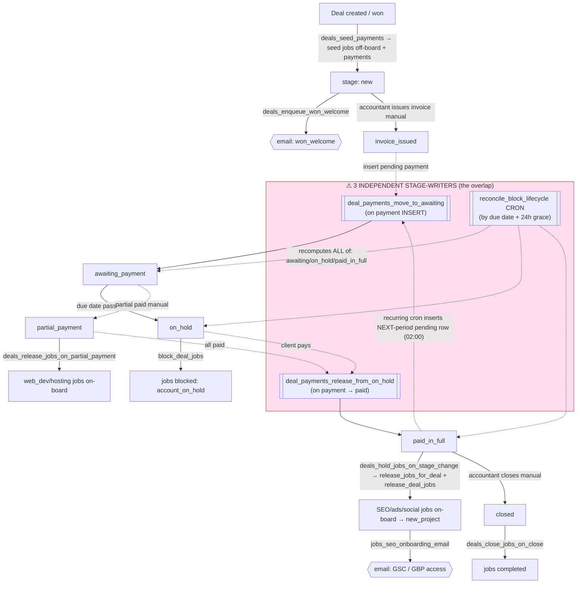
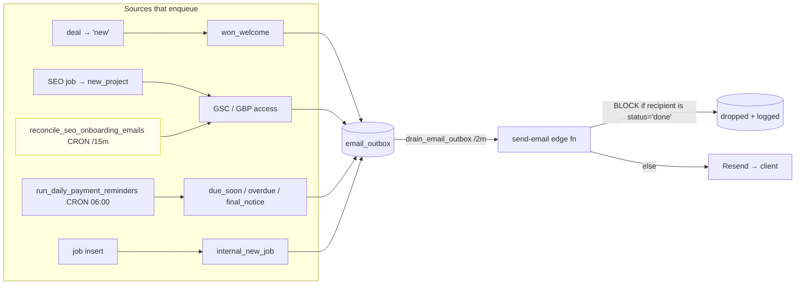

# Accounting Processes — Full Map + Overlap Audit (2026-07-02)

**Purpose:** map *every* automated rule in the accounting layer — stage transitions, job creation, the block lifecycle, and all email triggers/sends — from the **live database**, then debug where rules **overlap or fight each other**. Built from `pg_trigger` / `cron.job` / `pg_get_functiondef`, cross-checked with live savepoint probes.

> **✅ SHIPPED 2026-07-02** — the root overlap below is fixed. `accounting_stage` now has ONE owner (`reconcile_deal_stage`, a due-date rule called instantly on payment changes + by the nightly sweep). The 24h grace, `move_to_awaiting`, and `release_from_on_hold` are retired. Decision B: the system flags deals *into* On Hold on overdue but never auto-lifts a hold (the accountant does, which unblocks jobs). See `docs/superpowers/specs/2026-07-02-accounting-stage-single-owner-design.md`.

**TL;DR of the audit:** the system is over-complex in one specific, fixable way — **the deal's `accounting_stage` is written by three independent mechanisms** (a payment-insert trigger, a payment-paid trigger, and a nightly due-date cron) *plus* manual drags. They disagree, so the stage flip-flops. Every "flip fix / 24h grace / mitigation" shipped this session is a **patch over that one overlap.** Detail + evidence below.

---

## 1. The accounting stage machine

Board `accounting_onboarding`, in order:

```
new → awaiting_payment → on_hold → documents_verified → invoice_issued
→ partial_payment → paid_in_full → done → closed
```

`done` and `closed` are terminal. The stage is *supposed* to reflect "where is this deal in the pay/onboard cycle," but nothing owns it exclusively.

## 2. Full inventory (what's wired, from the live DB)

### Triggers that WRITE `deals.accounting_stage_id` (the "movers")
| Fires on | Trigger → function | What it does |
|---|---|---|
| `deal_payments` **AFTER INSERT** (status≠paid) | `deal_payments_move_to_awaiting` | moves the deal **→ awaiting_payment** unless it's in `new`/`on_hold`/`partial_payment`/terminal |
| `deal_payments` **AFTER UPDATE → paid** | `deal_payments_release_from_on_hold` | if `on_hold`/`partial_payment` + no past-due unpaid + has payment_method → **→ paid_in_full** |
| **cron 02:20** | `reconcile_block_lifecycle` | recomputes stage from earliest unpaid due date (`target_accounting_stage`): null→`paid_in_full`, ≤today→`on_hold`, ≤today+7→`awaiting_payment`, else→`paid_in_full`; **+ 24h grace** so a <24h-old row can't flip OUT of paid_in_full |
| manual | accountant drags on kanban | sets it directly |

### Triggers that GUARD or REACT to a stage change
| Trigger → function | Behaviour |
|---|---|
| `deals_payment_method_required` → `guard_payment_method_before_stage_move` (BEFORE UPDATE) | **raises** `payment_method_required` if the stage changes while `payment_method IS NULL` |
| `deals_sync_client_status` → `deals_sync_client_status_on_stage_change` (BEFORE UPDATE) | `partial/paid_in_full`→client `active`; `on_hold`→client `blocked`; `done`→client `done` |
| `deals_hold_jobs_on_hold` → `deals_hold_jobs_on_stage_change` (AFTER UPDATE) | `on_hold`→`block_deal_jobs`; **`paid_in_full`→`release_jobs_for_deal(false)` + `release_deal_jobs`**; `partial_payment`→noop; else→unblock `account_on_hold` jobs |
| `deals_release_jobs_partial_payment` → `deals_release_jobs_on_partial_payment` (AFTER UPDATE) | `partial_payment`→`release_jobs_for_deal(true)` (web_dev/hosting only, blocked `partial_payment_pending`) |
| `deals_close_jobs_on_close` → `deals_close_jobs_on_close` (AFTER UPDATE) | `closed`→complete jobs + move to each board's `closed` lane + unblock |

### Deal / payment seeding
- `deals_seed_payments` (deals AFTER INSERT) → `seed_deal_jobs_and_payments` — seeds jobs (SEO off-board) + payment rows when a deal is created.
- `deal_payments_default_service_keys` (BEFORE INSERT), `deal_payments_no_duplicate_period` (BEFORE INSERT, dedup), `deal_payments_created_at_immutable` (BEFORE UPDATE), `deal_payments_recompute_job_dates` (derives `jobs.period_*`).

### Job triggers
- `jobs_seo_onboarding_email` (AFTER INSERT OR UPDATE OF stage_id) → GSC (web_seo) / GBP (local_seo) email **when stage becomes `new_project`**.
- `email_notify_new_job` (jobs AFTER INSERT) → internal `internal_new_job` email to the team.
- `enforce_no_stage_move_when_blocked` (BEFORE UPDATE) → blocks a job's stage move if the client is blocked (non-admin).
- `jobs_sync_deal_pricing` (AFTER I/U/D) → recomputes the deal amount from its jobs.
- owner + seed triggers: `jobs_local_seo_owner`, `jobs_web_seo_owner`, `jobs_seed_local_profile_url`, `jobs_seed_web_website`, `jobs_set_code`.

### Crons (UTC)
| Time | Cron | Effect |
|---|---|---|
| 02:00 | `ensure_recurring_payments` | inserts the **next-period** payment row for recurring services |
| 02:15 | `mark_overdue_payments` | `pending`→`overdue` where past due |
| 02:20 | `reconcile_block_lifecycle` | moves deal stages by due date + blocks/unblocks jobs |
| 04:00 | `reconcile_payment_integrity` | audit → `data_integrity_alerts` + admin notifications |
| 06:00 | `daily_payment_reminders` → `run_daily_payment_reminders` | reconcile **then** enqueue reminders |
| 06:30 | `process_email_sequences` | sales cadences |
| */15m | `reconcile_seo_onboarding_emails` | re-fires missed SEO onboarding emails |
| */2m | `drain_email_outbox` | POSTs the outbox to the `send-email` edge function |

### Emails (all → `email_outbox` → drain → `send-email` → Resend)
| Template | Trigger | Gate |
|---|---|---|
| `won_welcome` | deal stage → `new` (`deals_enqueue_won_welcome`) | `won_welcome` toggle + dedupe per recipient |
| `webseo_gsc_access` | web_seo job → `new_project` | `webseo_gsc` toggle + dedupe `webseo_gsc:<deal>` |
| `localseo_gbp_access` | local_seo job → `new_project` | `localseo_gbp` toggle + dedupe `localseo_gbp:<deal>` |
| `payment_due_soon` | cron: awaiting_payment + due in ≤7d | not done, not back-dated, paid_at null, not suppressed |
| `payment_overdue` | cron: on_hold + 1–6d overdue | same |
| `payment_final_notice` | cron: on_hold + ≥7d overdue | same |
| `internal_new_job` | job insert | `internal_new_job` toggle |
| **Every send** | — | **chokepoint blocks any recipient who is a `status='done'` client** |

## 3. Diagram — deal accounting lifecycle (who moves the stage, what fires)



## 4. Diagram — email triggers & sends



---

## 5. DEBUG — where rules overlap / fight (ranked)

### 🔴 #1 — The deal stage has THREE independent writers (root cause of every flip bug)
`accounting_stage` is written by (a) `deal_payments_move_to_awaiting` on **payment INSERT**, (b) `deal_payments_release_from_on_hold` on **payment→paid**, and (c) the `reconcile_block_lifecycle` **cron by due date** — *plus* manual drags. They key off different signals and disagree.

**Live evidence (savepoint, rolled back):** put a deal in **paid_in_full**, inserted **one** pending future payment (what the recurring cron does nightly) → deal instantly became **awaiting_payment**. The accountant's/paid state was overridden by an INSERT-event trigger.

**Consequences you've felt:** the paid_in_full "flip-flop", the 4-layer flip fix, the 24h grace (L3), the 6 mitigations, the SL6 test surprise, missed overdue reminders during grace — **all are patches over this single overlap.** The more we patch, the more complex it gets, which is exactly your intuition.

### 🔴 #2 — The nightly recurring cron re-triggers #1 on purpose
`ensure_recurring_payments` (02:00) inserts the next-period row → fires `move_to_awaiting` (#1) → bumps healthy paid_in_full deals to awaiting_payment → `reconcile` (02:20) then tries to move them back, gated by the 24h grace. So **every night** the system fights itself and relies on a timing grace to settle. Fragile by construction.

### 🟠 #3 — Job creation happens from two overlapping stage handlers
`partial_payment` releases web_dev/hosting; `paid_in_full` releases **everything again** (incl. web_dev/hosting) via a different function. Idempotency guards save it, but there are two code paths placing the same jobs, with different block flags (`partial_payment_pending` vs unblocked). Divergence risk on any future edit.

### 🟠 #4 — Four block reasons, several setters/unsetters (no single owner)
Jobs can be blocked with `account_on_hold` (stage trigger), `partial_payment_pending` (partial handler), `billing_paused` (pause RPC), or `client_blocked` (client status). They're set/cleared by `deals_hold_jobs_on_stage_change`, `reconcile_block_lifecycle`, `deals_close_jobs_on_close`, `block_deal_jobs`, and the pause RPCs. No single function owns "is this job blocked and why," so unblock logic has to enumerate reasons (and can miss one).

### 🟡 #5 — Two paths send the SEO onboarding email
`jobs_seo_onboarding_email` (trigger on stage→new_project) **and** `reconcile_seo_onboarding_emails` (cron /15m). Deduped by `webseo_gsc:<deal>` so no double-send today, but two mechanisms with independent gating = a place for "why didn't it send / why did it send" confusion (and it's why the badge shows some New-Project jobs as "not sent").

### 🟡 #6 — The reminder stage-lock now depends on #1/#2 settling correctly
The reminders I just shipped require exact stages (awaiting→due_soon, on_hold→overdue/final). But whether a deal is in the "right" stage depends on the 3 fighting writers + the 24h grace. A deal that *should* be on_hold but is held in paid_in_full by grace silently gets **no** overdue email that day. Correct by the rule, surprising in practice.

### ⚪ #7 (minor, mostly unreachable) — guard vs auto-movers
`guard_payment_method_before_stage_move` raises if a stage change happens with `payment_method IS NULL`. The auto-movers (`move_to_awaiting`, reconcile) also move stages; if such a deal existed, a payment insert could raise and fail. In practice the guard also blocks *entering* the movable stages without a method, so it's self-consistent — noting it for completeness.

---

## 6. Root cause & direction (feeds the plan)

**One sentence:** `accounting_stage` is treated as *both* a derived value (from due dates, by the cron) *and* an imperatively-set value (by event triggers + manual drags) — three writers, no owner.

**The simplification (to be designed in the plan):**
- Make **one** mechanism own the stage. The natural owner is the **due-date reconcile** (it already computes the correct target). Demote the two event triggers:
  - `move_to_awaiting` should **not** override `paid_in_full` (or should only nudge `new`/`invoice_issued` forward, never pull a settled deal backward).
  - `release_from_on_hold` becomes redundant if reconcile owns the stage (reconcile already promotes to paid_in_full when nothing is due).
- Then the **24h grace, the flip fix layers, and several mitigations can be retired** — they exist only to referee the fight.
- Collapse the block reasons behind **one** `job_is_blocked(job)` owner.
- Pick **one** path for the SEO onboarding email (keep the reconcile cron as the single source, or the trigger — not both).

This removes the fragility without changing what the accountant sees day-to-day. The implementation plan (next step) will sequence it as small, independently-testable, reversible changes with the existing 100+-scenario harness as the safety net.
