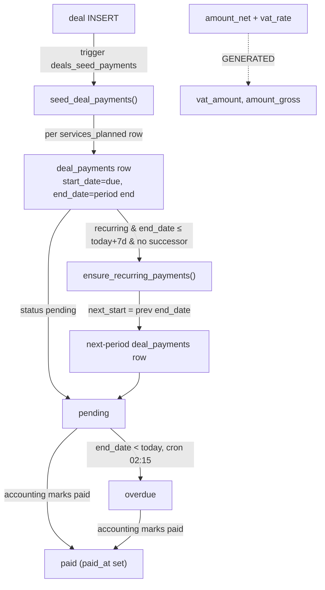

# Billing model (deal_payments)

**Purpose** — The per-deal payment schedule: how rows are seeded from the sold services, how recurring periods auto-extend, and how net/VAT/gross amounts and due dates are stored (read-only by the lifecycle).

## Data model

**`deal_payments`** — one row per scheduled installment / billing period.

| column | notes |
| --- | --- |
| `deal_id uuid` | FK → `deals(id)` `ON DELETE CASCADE` |
| `service_type text`, `service_index int` | which sold service this row bills; `service_index` ties a recurring series together |
| `billing_type text` | CHECK `('one_time','recurring_monthly','recurring_yearly')` |
| `label text` | optional human label |
| `amount_net numeric(12,2)` | **authoritative net amount** (not `amount`) |
| `vat_rate numeric(5,2)` | default `24.00`; bounded 0–100 |
| `vat_amount numeric(12,2)` | **GENERATED** `round(amount_net * vat_rate / 100, 2)` |
| `amount_gross numeric(12,2)` | **GENERATED** `round(amount_net + amount_net * vat_rate / 100, 2)` |
| `amount numeric(12,2)` | **DEPRECATED** legacy gross; read `amount_gross` instead |
| `start_date date` | **the DUE date** — the single date the whole lifecycle reads |
| `end_date date` | period-end; only used by `ensure_recurring_payments` + overdue marking |
| `status text` | CHECK `('pending','paid','overdue','cancelled')` — `overdue` added `20260610000004`, `cancelled` added `20260702100000` (per-job billing pause). A **cancelled** row is an excused period: preserved in history but invisible to the billing state machine (`status <> 'cancelled'` is threaded through all 6 state-machine functions and the recurring-period UNIQUE index), and it can never go straight back to `paid` — see `financial-controls.md` |
| `invoice_number text`, `paid_at timestamptz` | |

Seed source: **`deals.services_planned`** (JSONB array of sold services with `billing_type`, `one_time_amount` / `monthly_amount`). `start_date` is seeded as `coalesce(deals.actual_close_date, current_date)`.

## Flow

## Functions / triggers / crons

- **`seed_deal_payments(target_deal_id)`** — idempotent (only seeds if the deal has zero payments). Reads `services_planned`; computes `end_date` = start +1 month / +1 year / = start (one-time); writes `amount_net` from gross via `round(gross / (1 + vat/100), 2)` at the 24% default. Fired by trigger **`deals_seed_payments`** (`AFTER INSERT on deals`, via `deal_payments_seed_after_insert`).
- **`ensure_recurring_payments()`** — for every recurring row whose `end_date <= current_date + 7 days` with no successor for `(deal_id, service_index)`, inserts the next period (`next_start = end_date`, copying `amount_net` + `vat_rate` forward). Returns count. Called on kanban/page mount (frontend) and is the source of new due dates. Idempotent.
- **`mark_overdue_payments()`** — daily cron `mark-overdue-payments` at **02:15 UTC**. Flips `pending` → `overdue` where `end_date < current_date`. Runs before reminders (06:00) and the reconciler (02:20).
- **`deal_payments_set_updated_at`** — `BEFORE UPDATE` housekeeping trigger.

## Gotchas

- **`amount_gross` and `vat_amount` are GENERATED stored columns** — you cannot insert/update them directly. Write `amount_net` + `vat_rate`; the gross/VAT recompute automatically. `seed`/`ensure_recurring` both write the net side only.
- **Read `amount_gross`, never `amount`.** `amount` is the deprecated legacy gross column (marked for drop after 2026-07-01). Reminders, ledgers, and the totals view use `amount_gross`.
- **`start_date` is the DUE date, not the period start.** The entire block/On-Hold lifecycle keys off `start_date` (see `block-lifecycle.md`). `end_date` is only used by recurring extension and overdue marking. **Nothing in the lifecycle ever writes `start_date`/`end_date`** — that is a hard non-negotiable constraint; only accounting (or seeding/recurring generation) sets dates.
- **VAT default is 24% (Greek).** Non-GR clients are billed at 0%; after seeding, accounting must edit `vat_rate` per row. The original backfill keyed on `clients.country = 'Greece'`. Since `20260827200000`, `seed_deal_payments` and `ensure_recurring_payments` source that rate from the single VAT rule **`deal_vat_rate(deal_id)`** (cash/no-VAT deals → 0%, else `vat_rate_for_country(country)`) instead of an inline CASE — never reintroduce a local copy of that logic. See `financial-controls.md`.
- **Money guards apply to every write.** A `paid` row needs a real, non-future `paid_at`; a `cancelled` row must be restored to `pending` before it can be paid; a paid row inside a locked accounting period cannot be money-edited or deleted at all. Details and unlock procedure: `financial-controls.md`.
- **Recurring series are linked by `(deal_id, service_index)`**, not by `service_type` — splitting/editing a row keeps the index so the successor check works.
- **DO NOT swap `ensure_recurring_payments` to a v2 that recomputes amounts** without first backfilling `jobs.amount_net`; the v1 copies the amount forward intentionally (see the recurring-payments memory note — €0 jobs would bill €0).

## File references

- `supabase/migrations/20260503000010_deal_payments.sql` — table, `seed_deal_payments`, `ensure_recurring_payments`, seed trigger.
- `supabase/migrations/20260601000005_deal_payments_vat.sql` — `amount_net`/`vat_rate` + GENERATED `vat_amount`/`amount_gross`; rewrites seed/recurring to net basis.
- `supabase/migrations/20260610000004_money_seeding_and_overdue.sql` — `status='overdue'` + `mark_overdue_payments` cron.
- `supabase/migrations/20260616110538_seed_payments_net_basis.sql`, `20260617000006_deal_payment_lines.sql`, `20260617000007_deal_payments_totals_view.sql` — net-basis + per-line breakdown + totals view.
- `supabase/migrations/20260702100000_job_billing_pause.sql` — `status='cancelled'` + `job_pause_billing` / `job_resume_billing`.
- `src/features/accounting/AccountingRecurringPage.tsx`, `hooks/useRecurringClients.ts` — recurring billing UI.
- `docs/tech/accounting/financial-controls.md` — the guards, period locks and alerts that police this table.
