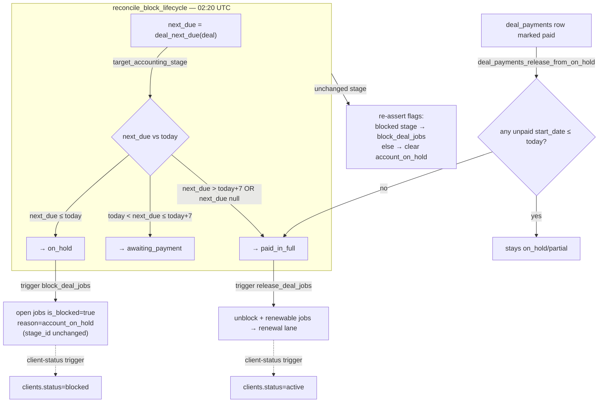

# Payment-driven block & On-Hold lifecycle

**Purpose** — How a deal's accounting stage is re-asserted nightly from the payment due date, and how "blocking" pauses a deal's open jobs as a virtual overlay (a flag, never a stage move).

## Data model

- **`deals.accounting_stage_id`** — the single source of truth. "Blocked" *is* the deal being in `on_hold` or `partial_payment`; "resting/active" = `paid_in_full` / `awaiting_payment` / `new` / `documents_verified` / `invoice_issued`; terminal (never auto-touched) = `done` / `closed`.
- **`deal_payments.start_date`** — the **due date**. `deal_next_due(deal_id)` = the earliest unpaid `start_date`.
- **`jobs`** (the virtual block overlay — `stage_id` is NEVER changed by blocking):
  - `is_blocked boolean`, `blocked_reason text` (this feature uses `'account_on_hold'`), `blocked_at`, `blocked_by`.
  - `service_type text`, `stage_id uuid` → `pipeline_stages`, `archived`, `parent_job_id` (AI SEO children).
- **`clients.status`** — `'blocked'` while the deal is in a blocked stage, `'active'` on `paid_in_full` (kept in sync by the client-status trigger).

### Block scope

Blocked set = the deal's **open** jobs (non-archived, non-terminal-stage) **EXCEPT**:
- `web_dev` (the website) — never blocked.
- `hosting` — never blocked.
- terminal-stage jobs.
- **`done`-stage jobs** (cycle finished — nothing to pause; added `20260626000019`).

The **AI SEO billing parent** has a null work stage (nothing to block on it directly); its `web_seo`/`local_seo` children block as part of the same deal sweep, so the unit blocks/unblocks together.

## Flow

## Functions / triggers / crons

- **`target_accounting_stage(next_due, today)`** — pure `immutable` SQL. `null` → `paid_in_full`; `next_due <= today` → `on_hold`; `next_due <= today + 7` → `awaiting_payment`; else → `paid_in_full`. (Boundary unit-tested at −8/−7/−1/due/overdue.)
- **`deal_next_due(p_deal_id)`** — `min(start_date)` of the deal's unpaid (`status <> 'paid'`) payments. Read-only.
- **`block_deal_jobs(p_deal_id)`** — sets `is_blocked=true, blocked_reason='account_on_hold'` on the open, non-`web_dev`/`hosting`, non-terminal, **non-`done`** jobs. Idempotent (`and not j.is_blocked`).
- **`release_deal_jobs(p_deal_id)`** — current version (`20260626000020`): moves EVERY non-terminal renewable job (`web_seo`/`local_seo`/`ads`/`social_media`) of the deal to its board's `renewal` lane and clears the block; non-renewable jobs (`web_dev`/`hosting`/AI SEO parent) are only unblocked. See `renewal-close.md`.
- **`deals_hold_jobs_on_stage_change()`** — trigger `deals_hold_jobs_on_hold` (still pointed at this function name). On stage change: `on_hold` → `block_deal_jobs`; `paid_in_full` → `release_deal_jobs`; `partial_payment` → no-op; other → clear `account_on_hold` flags.
- **`deal_payments_release_from_on_hold()`** — trigger on `deal_payments`. When a row flips to `paid`, if the deal is in `on_hold`/`partial_payment`, has `payment_method` set, and has **no unpaid payment with `start_date <= current_date`**, it advances the deal to `paid_in_full` (which fires the release). Due-date based (not end_date).
- **`reconcile_block_lifecycle(p_allow_release default false)`** — nightly cron **`reconcile_block_lifecycle` at 02:20 UTC** (`'20 2 * * *'`). For each non-terminal deal with a `payment_method` and at least one dated payment: compute `target_accounting_stage`; if the deal is in the managed set `{awaiting_payment, on_hold, paid_in_full}` and the target differs, move it (firing the hold + client-status triggers). On unchanged stage it **re-asserts flags** (block if blocked stage, else clear `account_on_hold`). Finally it clears stray `account_on_hold` blocks on terminal/`done` jobs. Nightly passes `false` (does NOT auto-release On-Hold → Paid); that's payment-driven. The one-time backfill passed `true`.
- **Retired:** `move_overdue_deals_to_on_hold()` / cron `daily_move_overdue_deals_to_on_hold` (end_date based) — deactivated; superseded by the reconciler.

## Gotchas

- **The reconciler does NOT auto-release On-Hold → Paid in nightly mode.** Release is payment-driven (`p_allow_release=false`). Only the one-time backfill (`true`) corrected over-held deals. If a paid deal is stuck On-Hold, mark the payment `paid` (fires `deal_payments_release_from_on_hold`) — don't expect the nightly to un-hold it.
- **Blocking never moves a job.** `is_blocked` is a virtual "Blocked" column overlay; `stage_id` is untouched, so the job returns to its exact stage on unblock. The only intentional stage moves are Paid→Renewal and Closed→Closed.
- **`done` and terminal jobs are excluded** from blocking (and proactively un-blocked by the reconciler's final sweep). A finished-for-the-cycle (`done`) job on an On-Hold deal is correctly never blocked.
- **Deals with `payment_method IS NULL` are skipped entirely** by the reconciler — otherwise the `guard_payment_method_before_stage_move` trigger would raise. So a null-payment-method deal silently never auto-holds/releases.
- **`partial_payment` stays blocked** until `paid_in_full`; the nightly mover never auto-moves it (it's outside the move when `cur_code = partial_payment`; left to accounting / the partial-payment spawn mechanism).
- **`deal_payments_move_to_awaiting` will NOT un-hold an overdue deal** when a new recurring period is generated — it explicitly skips `new`/`on_hold`/`partial_payment` (otherwise generating next month would silently unblock an owing client).
- **Self-healing window is up to 24h.** Events fire instantly for response; the reconciler is the nightly safety net that corrects any drift (manual edits, imports, missed events).

## File references

- `supabase/migrations/20260626000010_block_lifecycle_helpers_and_hold.sql` — `target_accounting_stage`, `deal_next_due`, `block_deal_jobs`, `release_deal_jobs`, rewritten `deals_hold_jobs_on_stage_change`.
- `supabase/migrations/20260626000011_release_duedate_and_awaiting_guard.sql` — `deal_payments_release_from_on_hold` (due-date), `deal_payments_move_to_awaiting` guard.
- `supabase/migrations/20260626000012_block_lifecycle_reconciler.sql` — `reconcile_block_lifecycle` + 02:20 cron; retires the old overdue cron.
- `supabase/migrations/20260626000013_block_lifecycle_backfill.sql` — one-time backfill + `*_block_lifecycle_backup_20260626` tables.
- `supabase/migrations/20260626000019_block_excludes_done.sql` — `done`-job exclusion in `block_deal_jobs` + reconciler cleanup.
- `supabase/migrations/20260503000020_client_status_auto_transitions.sql` + `20260622260000_done_keeps_deal_on_kanban.sql` — `clients.status` ↔ accounting-stage linkage.
- `src/features/jobs/kanbanGrouping.ts` (+ `.test.ts`), `JobsKanbanPage.tsx`, `JobsKanbanCard.tsx` — the virtual Blocked column UI.
