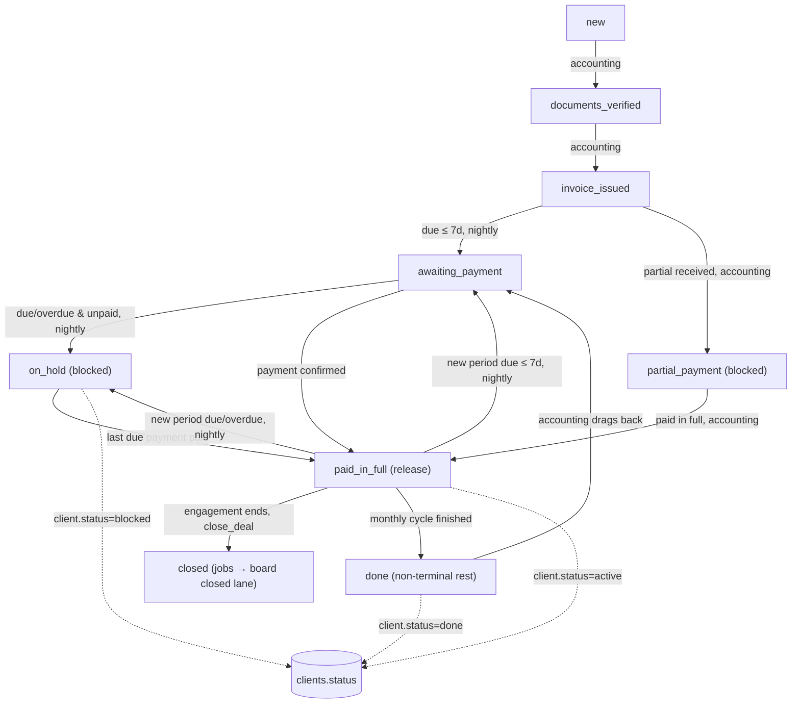

# Deal accounting lifecycle

**Purpose** — How a deal moves through the `accounting_onboarding` board, which stage transitions are automatic vs. accounting-driven, and what the single source of truth ("the deal's accounting stage") drives downstream.

## Data model

- **`deals`**
  - `accounting_stage_id uuid` → `pipeline_stages.id` (board = `accounting_onboarding`). The authoritative state.
  - `payment_method text` — must be non-null before any stage move (see guard below).
  - `client_id uuid` — drives the client-status linkage.
  - `accounting_completed_at timestamptz` — set when accounting is completed; used by `deal_payments_move_to_awaiting` to leave finished deals alone.
  - `archived`, `archived_at`, `archived_reason` — note: `done` no longer archives (changed in `20260622260000`).
  - `suppress_payment_reminders boolean` — per-deal reminder mute.
  - `code text` — client/deal code (e.g. `001089`), used in reminder subjects.
- **`pipeline_stages`** (board = `accounting_onboarding`) — the stages, with `code`, `position`, `is_terminal`, `terminal_outcome`, `triggers_action`.
- **`clients`** — `status text` is auto-derived from the deal's accounting stage (`active` / `blocked` / `done`).

### Accounting stages (codes, `position`, terminal?)

| code | position | terminal | notes |
| --- | --- | --- | --- |
| `new` | 10 | no | brand-new deal; never auto-moved |
| `documents_verified` | 20 | no | accounting-driven |
| `invoice_issued` | 30 | no | accounting-driven |
| `awaiting_payment` | 40 | no | due ≤ 7 days away (auto) |
| `partial_payment` | 50 | no | blocked stage; stays until paid_in_full |
| `paid_in_full` | 60 | **yes** | `terminal_outcome='paid'`, `triggers_action='complete_accounting'`; release event |
| `on_hold` | 70 | no | blocked stage; due/overdue & unpaid (auto) |
| `refunded` | 80 | yes | `terminal_outcome='cancelled'` |
| `done` | (renamed from `refunded` historically) | — | **non-terminal monthly rest**; syncs client.status=`done`; does NOT archive |
| `closed` | 90 | no | added `20260617000002`; terminal-by-policy; fires job-close trigger |

> "Terminal (never auto-touched) = `done`, `closed`." The reconciler and movers explicitly exclude `ps.code not in ('done','closed')`.

## Flow

## Functions / triggers / crons

- **`guard_payment_method_before_stage_move()`** — `BEFORE UPDATE` trigger `deals_payment_method_required` on `deals`. Raises `payment_method_required` (errcode `check_violation`) if `accounting_stage_id` changes while `payment_method IS NULL`. Covers raw RPC/REST bypass; also wraps `complete_accounting`. The nightly reconciler therefore only processes deals with `payment_method IS NOT NULL`.
- **`deals_sync_client_status_on_stage_change()`** — `BEFORE UPDATE` trigger `deals_sync_client_status` (fires `WHEN new.accounting_stage_id IS DISTINCT FROM old.accounting_stage_id`). Maps stage → `clients.status`: `partial_payment`/`paid_in_full` → `active`; `on_hold` → `blocked`; `done` → `done`. As of `20260622260000` it no longer archives on `done`.
- **`deals_hold_jobs_on_stage_change()`** — `AFTER`-stage trigger `deals_hold_jobs_on_hold`. Routes job-block side effects: `on_hold` → `block_deal_jobs`; `paid_in_full` → `release_deal_jobs`; `partial_payment` → no-op (stays blocked); any other non-paid/non-partial code → clears `account_on_hold` flags. See `block-lifecycle.md`.
- **`deals_close_jobs_on_close()`** — `AFTER UPDATE OF accounting_stage_id` trigger; on entry to `closed`, moves all non-terminal jobs to their board `closed` lane. See `renewal-close.md`.
- **`reconcile_block_lifecycle(p_allow_release)`** — nightly cron `reconcile_block_lifecycle` at **02:20 UTC**. Re-asserts the correct stage from the payment due date for deals in the managed set `{awaiting_payment, on_hold, paid_in_full}`. See `block-lifecycle.md`.
- **`deal_payments_move_to_awaiting()`** — trigger on `deal_payments`; when a new recurring period is generated, advances eligible deals to `awaiting_payment`, but **never** pulls `new`/`on_hold`/`partial_payment`/terminal deals.
- **`seed_deal_payments` / `deal_payments_seed_after_insert`** — `AFTER INSERT` trigger `deals_seed_payments` seeds the payment schedule from `services_planned`.

## Gotchas

- **The accounting stage IS the state.** "Blocked" is not a separate flag on the deal — it is *defined as* being in `on_hold` or `partial_payment`. Don't introduce a parallel boolean; it will drift (the old model produced deal 000403 stuck On-Hold while fully paid).
- **`done` ≠ `closed`.** `done` is a non-terminal "monthly rest, waiting to renew" lane that does not archive (since `20260622260000`) and syncs `clients.status='done'`. `closed` is the terminal end-of-engagement stage that fires the job-close trigger. They are different stages with different semantics.
- **The reconciler only moves within `{awaiting_payment, on_hold, paid_in_full}`.** It never yanks a deal out of `new`/`documents_verified`/`invoice_issued`/`partial_payment` — those stay accounting-driven.
- **`payment_method` must be set first.** Any stage move on a null-`payment_method` deal raises `payment_method_required`. The reconciler filters these deals out entirely (`d.payment_method is not null`), so a deal with no payment method silently never auto-advances.
- **Deals with no payment / no due date are never touched** by the nightly automation (`exists (... deal_payments dp where dp.start_date is not null)`).

## File references

- `supabase/migrations/20260502000002_pipeline_stages.sql` — seeds the accounting stages.
- `supabase/migrations/20260617000002_accounting_closed_stage.sql` — adds `closed`.
- `supabase/migrations/20260503000009_payment_method_required_for_move.sql` — `guard_payment_method_before_stage_move`.
- `supabase/migrations/20260503000020_client_status_auto_transitions.sql` + `20260622260000_done_keeps_deal_on_kanban.sql` — client-status linkage (and the de-archiving of `done`).
- `supabase/migrations/20260626000010..22_*.sql` — the payment-driven block + done/renewal/closed lifecycle.
- `src/features/accounting/AccountingOnboardingKanbanPage.tsx`, `AccountingKanbanColumn.tsx`, `AccountingKanbanCard.tsx` — the board UI.
- `src/features/deals/accountingStageMove.ts` (+ `.test.ts`) — client-side stage-move helper.
