# Financial controls (the money contract)

**Purpose** — What the financial-correctness program (2026-08-27/28) put in
place so that money in this CRM cannot silently drift again: what is physically
impossible now, what is merely watched, and what still needs an owner decision.
Read this before touching `deal_payments`, `expenses`, VAT, or period figures.

Sources: `docs/system-analysis/2026-08-27-expenses-reporting-audit.md` (the
reporting audit) and the money audit that produced the A0/B3/E-series findings.
Companion docs: `billing-model.md` (the schedule), `reporting.md` (the numbers),
`block-lifecycle.md` (blocks/On-Hold), `payment-reminders.md` (the dunning
pipeline).

## The three defense layers

```mermaid
flowchart LR
  subgraph L1["1 · Entry — bad data cannot be written"]
    a1["money_paid_needs_date()"]
    a2["deal_payments_block_cancel_revive()"]
    a3["deal_vat_rate() — one VAT rule"]
  end
  subgraph L2["2 · Locks — closed months cannot be edited"]
    b1["accounting_period_locks"]
    b2["money_period_lock_guard()"]
    b3["lock/unlock_accounting_period()"]
  end
  subgraph L3["3 · Watch — what slipped through is visible"]
    c1["accounting_integrity_alerts() checks 26-30<br/>live, per page load"]
    c2["data_integrity_alerts (04:00 cron)<br/>+ resolve RPCs"]
  end
  L1 -->|"what the guards cannot judge"| L2
  L2 -->|"what predates the guards<br/>or is owner-gated"| L3
```

The layers are ordered by strength, not by time. Layer 1 raises an exception —
no UI, script, cron or RPC can get around it. Layer 2 raises an exception too,
but only for months an admin explicitly closed. Layer 3 never blocks anything;
it makes a standing population **visible**, which is the whole point — €1,297.78
of wrongly-collected VAT sitting on an alerts page is a decision waiting to be
made; the same money invisible is a loss.

---

## Layer 1 — Entry guards

| Object | Kind | Attached as | Raises when |
| --- | --- | --- | --- |
| `public.money_paid_needs_date()` | trigger fn (INVOKER) | `deal_payments_paid_needs_date_trg`, `expenses_paid_needs_date_trg` — BEFORE INSERT OR UPDATE on both money tables | a row is set `status='paid'` with `paid_at is null` → *"paid rows require paid_at (the real payment date)"*; or with `paid_at::date > current_date + 1` → *"paid_at cannot be in the future"* |
| `public.deal_payments_block_cancel_revive()` | trigger fn (INVOKER) | `deal_payments_cancel_revive_trg` — BEFORE UPDATE on `deal_payments` | `old.status='cancelled'` and `new.status='paid'` → *"cancelled payment cannot become paid directly — restore it to pending first"* |
| `public.deal_vat_rate(p_deal_id uuid) returns numeric` | helper (DEFINER) | called by `seed_deal_payments`, `ensure_recurring_payments`, alert check 26 | — (not a guard; the single VAT rule: cash/no-VAT deals bill 0%, everyone else `vat_rate_for_country(client.country)`) |

Migrations: `20260827170000_paid_requires_paid_at.sql`,
`20260827180000_cancelled_transition_guard.sql`,
`20260827200000_money_integrity_checks.sql`.

**Why today+1 and not today**: a payment landing late in the day in a different
timezone should not be rejected; two days out is a typo, not a timezone.
Frontend mirrors the bound (`src/features/deals/paymentsPaidDate.ts` —
`maxPaidDateString()` = today+1) so the user sees the limit before the DB
enforces it.

**Autopay is not exempted and needs no exemption.** `settle_autopay_expenses`
and `set_expense_autopay` only settle rows whose `start_date <= current_date`
and write `paid_at = start_date`, so their `paid_at` is never in the future.
`accounting_prepay_months` writes `paid_at = now()`. `seed_deal_payments`
inserts pending rows only.

**UI surfaces that had to change** (all mark-paid paths now collect a date):
`PaymentsPanel.tsx` (popover date picker on the status button),
`ExpenseDetailDialog.tsx`, and the `ExpensesPage.tsx` bulk mark-paid flow.
A cancelled `deal_payments` row renders a "Cancelled" badge whose action is a
confirm dialog that restores it to `pending` (`paid_at: null`) — the only legal
route back.

**Kanban badge**: `src/features/accounting/accountingKanbanBadge.ts`
(`paidBadge()`) excludes cancelled rows from both numerator and denominator, so
a deal whose remaining rows are all paid reads *Paid*, not *Partial* (63 deals
flipped label at rollout — audit finding F28).

**Expense entry** (`NewExpenseDialog.tsx`): VAT is a conscious segmented choice
(0 / 24 / custom) with **no preselection** — submit is blocked until one is
picked. `paidByUserId` is wired end-to-end. A non-blocking "saving without a
receipt" note is always shown (this dialog has no upload field; receipts attach
later via `ExpenseDetailDialog`).

---

## Layer 2 — Period locks

`public.accounting_period_locks(period text pk 'YYYY-MM', locked_at, locked_by
uuid → profiles.user_id)`, RLS-enabled, `period_locks_admin_all` policy.
Migration `20260827190000_accounting_period_locks.sql`.

`public.money_period_lock_guard()` — **one** trigger function with a
`tg_table_name` branch (plpgsql resolves `old`/`new` field access at execution
time, so the `deal_payments` branch never evaluates on `expenses` and vice
versa), attached as `deal_payments_period_lock_trg` and
`expenses_period_lock_trg` (BEFORE UPDATE OR DELETE). For a row that is
`status='paid'` with a `paid_at` inside a locked month it raises:

- on UPDATE of a money-relevant field — *"period YYYY-MM is locked — unlock the month before editing paid rows"*
- on DELETE — *"period YYYY-MM is locked — paid rows cannot be deleted (unlock the month first)"*

Money-relevant fields are the amounts, `vat_rate`, `paid_at`, `start_date`,
`status`, plus `service_type` (deal_payments) and `vendor`/`category_id`
(expenses). Harmless fields — `notes`, `label`, receipt attachments, `autopay`
— stay editable in a locked month by design.

`public.lock_accounting_period(p_period text)` /
`public.unlock_accounting_period(p_period text)` — SECURITY DEFINER, admin-only
(raise `admin only` on the first line), `p_period ~ '^\d{4}-\d{2}$'`, granted to
`authenticated`. UI: `PeriodLockControl` on the Report page, admin-gated
(`src/features/accounting_report/components/PeriodLockControl.tsx` +
`hooks/usePeriodLocks.ts`), listing the last 12 months plus any locked month
outside that window so an old lock is never unreachable.

### Operating procedure

**When to lock a month.** Lock `YYYY-MM` once the month's figures are final:
all its expenses reconciled (not still `pending`), all its payments marked paid
with real dates, and the P&L for that range reviewed. Locking is an assertion
that *these numbers are the ones we filed* — from that moment the DB will not
let anyone quietly change them.

**How to unlock for a correction.** A locked month is not a wall, it is a
speed bump with a paper trail:

1. Admin unlocks the month via `PeriodLockControl` (or
   `select public.unlock_accounting_period('2026-05')`).
2. Make the correction.
3. **Write a data-fix note** under `docs/data-fixes/` — one file per fix,
   naming the rows, the before-state, and a tested rollback statement. This is
   the house convention established by
   `docs/data-fixes/2026-08-27-paid-at-backdate-repair.md` (Task 1's 141
   `deal_payments` + 6 `expenses` repair). A correction to a closed month
   without a note is how the next audit loses a day.
4. Re-lock the month.

**`convert_job_service_type` interaction — know this before you lock.** That
RPC issues two `update deal_payments set service_type = ...` with **no status
filter**, re-keying a job's payment history when an admin converts its service
type (e.g. `web_seo → local_seo`, or the AI SEO upgrade/teardown paths). If the
deal has a *paid* payment row in a *locked* month, the lock guard raises and the
**whole conversion aborts**. This is correct — `service_type` on a paid row is
money-relevant, and exempting the RPC would defeat the guarantee — but it means
a service-type conversion on a deal with locked paid history requires unlocking
that month first, exactly like any other correction. `jobs_backfill_payment_service_type`
has the same, much narrower collision (only rows whose `service_type` is null).

Every other live writer was audited and collides with nothing:
`mark_overdue_payments`, `ensure_recurring_payments`, `job_pause_billing`,
`settle_autopay_expenses`, `set_expense_autopay`,
`expenses_propagate_amount_forward` all filter to non-paid rows or to fields the
guard ignores.

---

## Layer 3 — The watch (alerts)

Two independent mechanisms, often confused:

| | `accounting_integrity_alerts()` | `data_integrity_alerts` |
| --- | --- | --- |
| How it runs | **live RPC**, evaluated on every load of `/accounting/alerts` | **04:00 cron** (`reconcile_payment_integrity()`, cron.job 14) persisting rows into a table |
| Visibility gate | returns 0 rows unless `current_user_is_admin()` or `current_user_in_group('accounting')` | admin-only RLS (`data_integrity_alerts_admin_read/write`) |
| Suppression | `integrity_alert_dismissals` (check_key + subject_id + signature) — reversible | `resolve_integrity_alert(p_id uuid)` / `resolve_integrity_alerts_kind(p_kind text)`, both admin-only SECURITY DEFINER — **one-way, no undo RPC** |
| Kinds | 30 checks (26-30 are this program's) | `duplicate_period`, `flip_out_of_paid_in_full` |

Both render in the same page (`src/features/accounting/alerts/AlertsPage.tsx`
— the cron section is "Νυχτερινοί έλεγχοι", admin-gated) and both feed the one
sidebar badge (`useAlertsCount.ts`).

**Note**: because the live RPC is admin/accounting-gated, calling it over the
Management API (where `auth.uid()` is NULL) returns **zero rows**. To measure a
standing population out-of-band, run the check's own detector SQL, not the RPC.

### Alert kinds added by this program (checks 26-30)

| # | `check_key` | Severity / category | What it means | Expected standing population |
| --- | --- | --- | --- | --- |
| 26 | `payment_vat_mismatch` | amber / money | A non-cancelled `deal_payments` row whose `vat_rate` disagrees with `deal_vat_rate(deal_id)`. Signature carries both sides, so editing either value re-surfaces the row instead of hiding behind a stale dismissal. | **46 — by design, until the owner decides.** 25 are the **A0** population (cash/no-VAT deals that were nonetheless charged VAT — real money collected that shouldn't have been), 21 are the **B3** mirror (online deals whose `vat_rate` was copied forward at 0% and never corrected — raising it now re-invoices a client). Neither is fixable by code. |
| 27 | `paid_backdate_gap` | red / lifecycle | `status='paid'` stamped more than 30 days after the row's own `start_date` — income attributed to the wrong month. Reference case: deal 000205, period started 2026-04-02, `paid_at` stamped 2026-08-06. | **0.** Standing guard; 0 is the healthy state. The historical class was repaired in Task 1. |
| 28 | `payment_missing_dates` | amber / missing | A non-cancelled payment row with `start_date is null`. Every date-driven mechanism downstream (renewals, due chips, reminders, check 27) silently no-ops on a dateless row. | **19** — 13 `pending` + **6 already `paid`**. The paid ones are worse: money changed hands into a row no month can see. |
| 29 | `expense_stale_pending` | amber / lifecycle | An expense still `pending` more than 60 days after its own `end_date` — either it was paid and nobody flipped it, or it is two months overdue. | **0** (verified firing against a planted probe). |
| 30 | `expense_zero_vat_streak` | grey / possible_mistakes | A `software` / `ads_spend` / `hosting_domains` expense entered in the last 7 days at 0% VAT. Does not fix the "all expenses are 0% VAT" finding (E5) — it nudges the question at entry. | **~6**, and it moves: it is a rolling 7-day window, so this number naturally rises and falls with entry activity. |

Links: payment kinds (26-28) route to `/deals/<deal_id>`; expense kinds (29-30)
carry no deal and route to `/accounting/expenses` (the list — expenses have no
per-row route). Alert `title`/`detail` text is generated server-side in SQL and
rendered verbatim, so a future check 31 needs **no** frontend change.

### The nightly backlog

`data_integrity_alerts` held **348 open rows** at rollout, all
`flip_out_of_paid_in_full`, oldest 2026-07-01. The group-resolve button exists;
nobody should mass-click it before understanding why 348 deals fell out of Paid
In Full over two months — that is a signal, not noise. And resolving has no
undo: a mistaken resolve needs a direct SQL `update ... set resolved_at = null`.

---

## Stage-vs-money lifecycle

`public.reconcile_deal_stage(p_deal_id uuid)` (migration
`20260828100000_lifecycle_partial_and_release.sql`, fired by the pre-existing
`deal_payments_reconcile_stage` trigger on every insert/update/delete of a
payment row):

- **`partial_payment` now escalates.** It gets its own branch computing the real
  outstanding balance (`sum(amount_gross)` over non-cancelled unpaid rows), not
  the older `next_due is null` proxy. Only exits: `balance <= 0 → paid_in_full`,
  `next_due < current_date → on_hold`. Otherwise the deal *stays* on
  `partial_payment` — the accountant's deliberate call is never overwritten by
  an `awaiting_payment` rung.
- **`on_hold` auto-releases at zero balance** → `paid_in_full`, unblocking jobs
  held with `blocked_reason='account_on_hold'`. (Deal 000233 had been stuck
  on_hold with a €0 balance for 5+ weeks; released at rollout.)

### Reminder eligibility of backfilled rows — read this before promising a client an email

This is a **correction** recorded during Task 7's review, and it is the single
most misread thing in this program.

`public.enqueue_payment_reminders` (pre-existing, untouched by this program)
only makes a `deal_payments` row reminder-eligible if it also passes
`dp.created_at::date < dp.start_date` — the row must have been **created before
its own due date**. The live function comments it as
`-- skip back-dated rows (2026-07-01 no-backdated rule)`. The intent is to stop
the pipeline from mass-emailing clients about old debt the moment a historical
row is entered. It applies **per row**, so one deal can be partly eligible and
partly not, and `<` is strict — a row created on the same day as its due date
fails.

Consequence for the 6 deals Task 7 moved to `on_hold`:

| Deal | Automated reminder for the debt that put it on hold? |
| --- | --- |
| 000063 | **Mixed** — two `local_seo` installments are eligible and will get `payment_final_notice`; its 2026-05-27 hosting row (created 2026-06-22) never will |
| 005690 | **Mixed** — the 2026-08-16 `web_dev` row is eligible; both 2026-07-16 rows (created same day) never will be |
| 000183 | **Never** — its only unpaid row was created after its own due date |
| 000225 | **Never** — its only overdue row was created 5 months after its due date |
| 004556 | **Never** — created same day as due (strict `<` fails) |
| 006846 | **Never** — created same day as due |

**000183, 000225, 004556 and 006846 will never receive an automated reminder
email for that debt.** This is not a delay or a queue backlog; the exclusion is
permanent under the current, intentional rule. What the escalation *does* give
is visibility: those deals now sit on `on_hold` on the accounting board with
their jobs blocked, and collection for them **must happen manually**. There is
no alert today for "on_hold with zero reminder-eligible rows" — a reasonable
future addition.

---

## The rules

1. **A paid row needs a real date.** `status='paid'` requires `paid_at`, and
   `paid_at::date <= current_date + 1`. No UI, script or cron is exempt.
2. **A cancelled payment revives only through `pending`.** `cancelled → paid`
   is blocked at the database; restore to `pending` (clearing `paid_at`) first.
   Cancelled rows are also invisible to the paid/partial Kanban badge.
3. **A locked month is read-only for money fields.** Amounts, `vat_rate`,
   `paid_at`, `start_date`, `status`, `service_type`, `vendor`, `category_id`
   cannot be edited or deleted on a paid row in a locked period — including by
   `convert_job_service_type`. Unlock → fix → write a `docs/data-fixes/` note →
   re-lock.
4. **VAT comes from `deal_vat_rate(deal_id)`, never from an inline CASE.**
   Cash/no-VAT deals bill 0%; everyone else gets
   `vat_rate_for_country(client.country)`. `ensure_recurring_payments` still
   copies a non-zero `vat_rate` forward rather than recomputing by country —
   deliberately, because recomputing would silently re-invoice the B3 cohort.
5. **Reporting lists go through `fetchAllPages` or an RPC.** Never add an
   unranged `.select()` to a reporting surface — PostgREST caps at 1000 rows and
   the truncation is silent. Summaries are computed in the database
   (`pl_summary_for_range`). See `reporting.md`.
6. **Recurring expense periods dedupe, and price edits propagate forward.**
   A duplicate recurring period (vendor + billing + start) is silently skipped
   on insert (`expenses_skip_duplicate_period`); editing `amount_net`/`vat_rate`
   on a recurring row propagates to the chain's **future pending** periods only
   (`expenses_propagate_amount_forward`).

---

## Still open — owner decisions the code deliberately does not make

These are visible, not fixed. Each is money that touches a client, or a policy
call no trigger can make:

1. **A0 — wrongly-collected VAT** on cash/no-VAT payment rows: refund, credit or
   write off. `payment_vat_mismatch` keeps them visible until decided. **Two
   figures are in circulation and must be reconciled before acting**: the
   original audit named 19 rows / €977.11; the live check-26 detector (which is
   broader — every non-cancelled row where `deal_vat_rate(deal_id)=0 and
   vat_rate>0`, including deals whose cash/no-VAT setting changed after the
   fact) counts 25 rows / €1,297.78 at rollout.
2. **B3 mirror** — 21 online-deal rows billed at 0% that should carry the country
   rate; correcting them raises client invoices, so it needs client
   communication first.
3. **Pending expense backlog** (the 2026-08-03 bulk import) — reconcile via the
   ExpensesPage bulk mark-paid flow, which now collects real dates. Profit is
   optimistically skewed until this is done.
4. **The 19 dateless payment rows** — need real due dates entered;
   `payment_missing_dates` nags daily.
5. **All-expenses-0%-VAT policy (E5)** — confirm whether that is actually
   correct; expense entry now forces a conscious choice either way.
6. **`deal_payments` RLS (E26)** — ~20 non-admin accounts can read payment rows
   via sales/clients grants: tighten or accept.
7. **When to press Lock** on 2026-01 … 2026-07, once Task 1's repair and the
   expense reconciliation settle those months' figures.
8. **Deal 000066 (ΦΟΥΡΝΑΡΗ)** — sales note says the client pays VAT by bank
   transfer but the deal is cash/no-VAT: set the «Χρέωση ΦΠΑ» flag or renewals
   will bill 0%.

Known parked follow-ups (engineering, not owner):

- `reconcile_block_lifecycle`'s nightly cursor filters
  `('awaiting_payment','on_hold','paid_in_full')` and still excludes
  `partial_payment` — theoretical gap only; the `deal_payments` trigger covers
  every normal path.
- `log_activity()`'s AFTER DELETE trigger on `clients` self-references the
  just-deleted id, so **no client is hard-deletable through any path that fires
  it**. Test clients get archived instead.
- Resolving a cron alert has no undo RPC, unlike the live alerts' reversible
  dismissals.

---

## Verified at rollout (2026-08-28)

Read-only sweep against production (project `xujlrclyzxrvxszepquy`) via the
Management API, 2026-08-28 01:05 local / 2026-08-27 22:05 UTC. All numbers are
as of that timestamp.

| # | Check | Query | Result |
| --- | --- | --- | --- |
| a | `paid_backdate_gap` population | `deal_payments` where `status='paid' and paid_at::date > start_date + 30` | **0** ✅ (the class Task 1 repaired has not returned) |
| b | Paid without a payment date | `status='paid' and paid_at is null`, both tables | **0** `deal_payments`, **0** `expenses` ✅ |
| c | A0 detector | non-cancelled rows where `deal_vat_rate(deal_id)=0 and vat_rate>0` | **25 rows** (all `paid`), **€1,297.78** VAT — the known owner-gated population, unchanged since Task 5 ⏸ (the original audit's narrower A0 figure was 19 rows / €977.11 — see decision 1) |
| c′ | Check 26 split | `vat_rate is distinct from deal_vat_rate(deal_id)`, non-cancelled | **46** = 25 A0 + 21 B3 ✅ matches the alert count |
| d | Program triggers present | `pg_trigger` | **6/6 present and enabled** ✅ — `deal_payments_paid_needs_date_trg`, `expenses_paid_needs_date_trg` (→ `money_paid_needs_date`), `deal_payments_cancel_revive_trg` (→ `deal_payments_block_cancel_revive`), `deal_payments_period_lock_trg`, `expenses_period_lock_trg` (→ `money_period_lock_guard`), `deal_payments_reconcile_stage` (→ Task 7's redefined `reconcile_deal_stage`) |
| e | Period locks | `count(*) from accounting_period_locks` | **0 rows** — the machinery is live, no real month is locked yet; that is the owner's button ⏸ |
| f | Stage-vs-money | non-archived deals on `partial_payment` holding an `overdue` row | **0** ✅ (all escalated). Live census: `partial_payment` 8, `on_hold` 35, `awaiting_payment` 31, `paid_in_full` 186. All 6 deals Task 7 escalated are still `on_hold` |
| g | Open nightly alerts | `data_integrity_alerts where resolved_at is null` | **348**, all `flip_out_of_paid_in_full`, oldest 2026-07-01 — unresolved on purpose ⏸ |

Alert standing populations at the same timestamp (measured with each check's own
detector SQL, since the RPC is admin-gated — see the note in Layer 3):
`payment_vat_mismatch` **46**, `paid_backdate_gap` **0**,
`payment_missing_dates` **19** (13 pending + 6 paid), `expense_stale_pending`
**0**, `expense_zero_vat_streak` **6**. No `integrity_alert_dismissals` rows
exist for any of the five kinds, so all five render at full count.

Also observed (context for decision 3 above): **105 pending expenses,
€61,917.66 gross** still awaiting reconciliation.

Live function definitions confirmed present, with `md5(pg_get_functiondef)`:

| function | security | md5 |
| --- | --- | --- |
| `money_paid_needs_date` | INVOKER | `0deb6c88e6b51045aa385e2e69c4a0d3` |
| `deal_payments_block_cancel_revive` | INVOKER | `0cabbec07f8f52c3a3c650a59b356514` |
| `money_period_lock_guard` | INVOKER | `ab233e3b93f945e5f6dd8d18467f9606` |
| `lock_accounting_period` | DEFINER | `ebff2704c8237e09dd62774464c4747f` |
| `unlock_accounting_period` | DEFINER | `a6aea05347705cc0d8b5c42054569cbd` |
| `deal_vat_rate` | DEFINER | `e62c3bde0af42131d92860f439fe1f76` |
| `accounting_integrity_alerts` | DEFINER | `8cfdac7b51f69f9062ecd6e0a11e74bf` |
| `resolve_integrity_alert` | DEFINER | `686fa9847207850af451a2793a81f83c` |
| `resolve_integrity_alerts_kind` | DEFINER | `5b7487f7654af33b6314711a3dfd9edf` |
| `reconcile_deal_stage` | DEFINER | `6c8933fe97414d97e149844197fd21b4` |

---

## File references

| Migration | What it added |
| --- | --- |
| `20260827170000_paid_requires_paid_at.sql` | `money_paid_needs_date()` + both `*_paid_needs_date_trg` triggers |
| `20260827180000_cancelled_transition_guard.sql` | `deal_payments_block_cancel_revive()` + `deal_payments_cancel_revive_trg` |
| `20260827190000_accounting_period_locks.sql` | `accounting_period_locks`, `money_period_lock_guard()`, both `*_period_lock_trg`, `lock_accounting_period` / `unlock_accounting_period` |
| `20260827200000_money_integrity_checks.sql` | `deal_vat_rate()`, checks 26-30 on `accounting_integrity_alerts()`, seed/recurring refactored onto the helper |
| `20260828090000_resolve_integrity_alerts.sql` | `resolve_integrity_alert()`, `resolve_integrity_alerts_kind()` |
| `20260828100000_lifecycle_partial_and_release.sql` | `reconcile_deal_stage()` — `partial_payment` escalation + `on_hold` auto-release |
| `20260702100000_job_billing_pause.sql` | (earlier) `'cancelled'` payment status + `job_pause_billing` / `job_resume_billing` |

Frontend: `src/features/accounting_report/components/PeriodLockControl.tsx`,
`hooks/usePeriodLocks.ts`, `components/NewExpenseDialog.tsx`,
`components/ExpenseDetailDialog.tsx`, `ExpensesPage.tsx`;
`src/features/deals/PaymentsPanel.tsx`, `paymentsPaidDate.ts`;
`src/features/accounting/accountingKanbanBadge.ts`;
`src/features/accounting/alerts/` (`AlertsPage.tsx`, `alertPresenters.ts`,
`cronAlertPresenters.ts`, `hooks/useCronAlerts.ts`,
`hooks/useResolveCronAlert.ts`, `hooks/useAlertsCount.ts`).

Data fixes: `docs/data-fixes/2026-08-27-paid-at-backdate-repair.md`.
