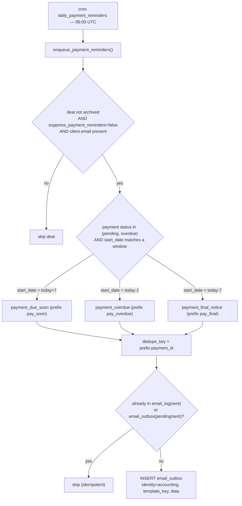

# Payment reminders

> **Current behavior (2026-08-31)** — parts of this doc predate the July/August
> rewrites. The live rules are: reminders fire ONLY for deals in accounting
> stage `awaiting_payment` (due-soon window: due within the next 7 days) or
> `on_hold` (overdue at 1–6 days past due, final notice at ≥7); one aggregated
> email per (deal, template, due date); back-dated rows
> (`created_at::date >= start_date`) never remind; clients with `status='done'`
> never get email; `deals.suppress_payment_reminders` mutes a deal; and — new —
> **a deal with zero PAID payments never gets any automated reminder** (first
> collections are handled personally; migration `20260831230000`). Authoritative
> chain: migrations `20260701020000` → `20260702140000` → `20260729100000` →
> `20260729110000` → `20260831230000`; harness `supabase/tests/enqueue_payment_reminders.sql`.

**Purpose** — The daily cron that queues client payment-reminder emails relative to each unpaid payment's due date (`deal_payments.start_date`), at −7 / +1 / +7 days, with per-deal suppression and idempotent dedupe.

## Data model

- **`deal_payments`** — `start_date` (the **due date** the reminders key off), `status` (`pending`/`overdue` rows are eligible; `paid` excluded), `amount_gross` (GENERATED), `service_type`, `deal_id`.
- **`deals`** — `suppress_payment_reminders boolean` (default false; when true the deal is skipped entirely), `archived` (must be false), `code` (client/deal code, used in the subject prefix `{{code}} - `).
- **`clients`** — `name`, `email` (must be non-null/non-empty to receive).
- **`email_templates`** — keys `payment_due_soon`, `payment_overdue`, `payment_final_notice` (Greek bodies; DB rows are authoritative for sending). `amount_gross` renders as `[ΠΟΣΟ]` / `{{amount_gross}}€`.
- **`email_outbox`** — queued rows: `identity='accounting'`, `to_email`, `template_key`, `data jsonb`, `dedupe_key`. The actual send is handled by the outbox drain (separate pipeline).
- **`email_log`** — sent-history; checked for dedupe.

## Flow

## Functions / triggers / crons

- **`enqueue_payment_reminders()`** — `SECURITY DEFINER`. Selects eligible `deal_payments` (status `pending`/`overdue`, client has email, deal not archived, **`suppress_payment_reminders = false`**) whose `start_date IN (current_date + 7, current_date - 1, current_date - 7)`. Picks the template by window, builds `dedupe_key = prefix:payment_id`, skips if already sent (`email_log`) or queued (`email_outbox`), and inserts into `email_outbox`. The `data` payload carries `code` (deal code), `client_name`, `service_type`, `amount_gross`, `due_date` (DD/MM/YYYY), `deal_id`. Returns count queued.
- **Cron `daily_payment_reminders`** — schedule `'0 6 * * *'` = **06:00 UTC** (~09:00 Athens summer). Disabled 2026-06-18, **re-enabled 2026-06-26** (`20260626000001`) after billing verification.
- **`mark_overdue_payments()`** — cron `mark-overdue-payments` at **02:15 UTC** flips `pending` → `overdue` where `end_date < current_date`. Runs before reminders so overdue rows are still picked up.
- Email sequences (`reengage`) are a separate system; the same `20260626000001` migration re-enabled them but they are unrelated to payment reminders.

## Gotchas

- **There is no "due today" reminder anymore.** The window is `−7 / +1 / +7` (`current_date + 7`, `current_date - 1`, `current_date - 7`). The `current_date` (due-today, `payment_due_today`) branch was dropped in `20260626000000`. The `payment_due_today` template row still exists in the DB but is no longer enqueued.
- **Reminders key off `start_date` (due date), NOT `end_date`.** This matches the block lifecycle. `end_date` is only relevant to overdue marking and recurring extension.
- **`amount_gross` is a GENERATED column.** Reminders read it directly; never try to compute gross client-side. The template variable is `{{amount_gross}}`.
- **Subjects are prefixed `{{code}} - `.** Before `20260626000004`, the enqueuer never passed `code`, so subjects rendered with a leading " - " (empty code). The current version passes `d.code` in the data payload.
- **Dedupe is per `(prefix, payment_id)`.** Re-running the cron the same day is safe; a reminder for a given payment+window fires once. A new recurring period is a new `payment_id`, so it gets its own reminders.
- **`suppress_payment_reminders` is per-deal** (Payment tab toggle, accounting/admin gated). Setting it true mutes all three reminders for that deal with no other behaviour change. Default false ⇒ no change for existing deals.
- **`status` CHECK is `('pending','paid','overdue')`.** Only `pending`/`overdue` rows are eligible; `paid` rows never generate reminders.
- **DB rows are authoritative** for subject/body — edit `email_templates` (by `key`), not the frontend `templates.ts`.

## File references

- `supabase/migrations/20260602000003_payment_reminders.sql` — original `enqueue_payment_reminders` + `daily_payment_reminders` 06:00 cron.
- `supabase/migrations/20260616000004_payment_reminder_sequence.sql` — the −7/+1/+7 sequence + `payment_final_notice` template.
- `supabase/migrations/20260616000005_drop_due_today_reminder.sql` — drops the due-today window.
- `supabase/migrations/20260626000000_deals_suppress_payment_reminders.sql` — `deals.suppress_payment_reminders` + skip predicate.
- `supabase/migrations/20260626000001_enable_payment_reminders_and_reengage.sql` — re-enables the cron.
- `supabase/migrations/20260626000004_payment_reminder_subject_code.sql` — passes `code` into the subject.
- `supabase/migrations/20260610000004_money_seeding_and_overdue.sql` — `mark_overdue_payments` 02:15 cron + `overdue` status.
- `src/features/deals/PaymentRemindersToggle.tsx` (+ `.test.tsx`) — the per-deal suppress toggle UI.
