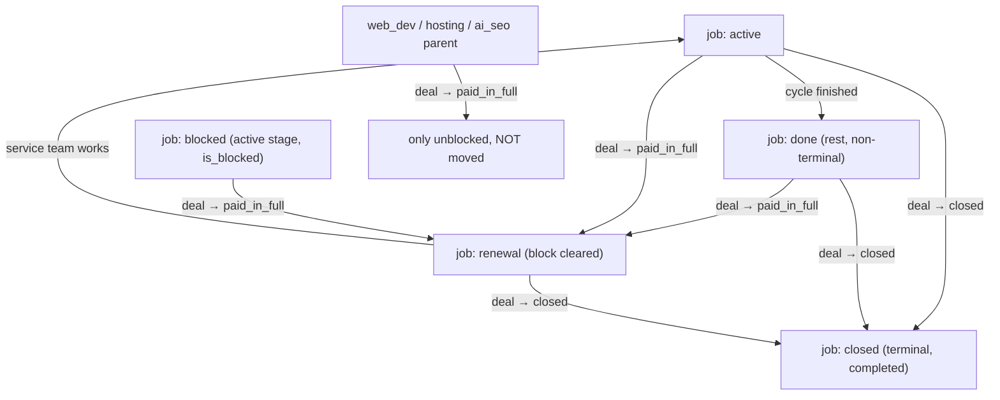

# Renewal & Close (job stage moves)

**Purpose** — The two intentional job stage moves in the recurring cycle: **Paid → Renewal** (every payment sends all renewable jobs to their board's Renewal lane) and **Closed → Closed** (closing a deal sends every existing job to its board's Closed terminal lane, never creating one).

## Data model

- **`deals.accounting_stage_id`** — entering `paid_in_full` triggers the renewal move; entering `closed` triggers the close move.
- **`jobs`** — `service_type`, `stage_id` → `pipeline_stages`, `is_blocked`/`blocked_reason`, `status`, `completed_at`, `archived`, `parent_job_id`.
- **`jobs.renewed_for_period`** (`20260804090000`) — the `period_start_date` the card was last sent to Renewal for. This is the renewal ledger: the SEO move fires exactly when `period_start_date > coalesce(renewed_for_period, onboarded_at + 14d)`, i.e. when a paid cycle exists that the card has not been renewed for. Stamped by `jobs_stamp_renewed_for_period` on **every** entry into a `renewal` stage — automatic, manual drag, or `force_job_renewal` — so it cannot drift.
- **`pipeline_stages`** per work board:
  - **`renewal`** lane — seeded for `web_seo`/`local_seo`; added to `ads`/`social_media` (`20260626000014`, position 15).
  - **`done`** lane — **non-terminal** "monthly rest" on `web_seo`/`local_seo`/`ads`/`social_media` (web/local flipped to `is_terminal=false`; ads/social `done` added at position 35 in `20260626000018`).
  - **`closed`** lane — the per-board terminal stage jobs land in on deal close.

The recurring cycle: **Active → Done (rest) → [client pays] → Renewal → Active …**, with terminal **Closed** when the engagement ends.

## Flow

## The SEO renewal move (current design, `20260804090000`)

For `web_seo`/`local_seo` the move is **ledger-driven** and lives in one place; four call sites feed it. Before this, the cycle test was duplicated in two places with date heuristics (`period_start_date > onboarded_at + 14d`, then `> done_at`), and both under-fired: deal 005014's card stayed in Done for a cycle the client had paid, because the `done_at` guard is false for **every payment that lands after the team finishes the month** — i.e. every late payment.

- **`seo_sync_renewal_job(job)`** — the only mover. Moves a non-terminal, on-board, onboarded SEO card to its board's `renewal` lane when `period_start_date > coalesce(renewed_for_period, onboarded_at + 14d)`, and returns whether it moved. Never recomputes period dates. Wraps its UPDATE in an exception block: `enforce_no_stage_move_when_blocked` raises `client_blocked` on any stage change for a blocked client, and a board move must never abort the payment that triggered it.
- **`seo_sync_renewal(deal)`** — `recompute_deal_job_period_dates` + the mover per job; returns how many moved.
- Call sites: (1) `deal_payments_sync_renewal_on_paid` — any payment landing on `paid`, or a paid row's dates changing; (2) `jobs_sync_renewal_on_period` — `AFTER UPDATE OF period_start_date` on `jobs`, which catches dates that arrive or get corrected later; (3) `release_deal_jobs` branch 1c, on the `paid_in_full` transition; (4) `reconcile_seo_renewal` nightly at 02:40 UTC.
- **`force_job_renewal(job)`** — manual escape hatch for accounting (admin or `accounting_onboarding.edit`), surfaced as **Send to Renewal** on the job page. Works on any renewable board, clears blocks, logs `kind='forced_renewal'` to `activity_log`.
- Alerts `seo_renewal_pending` / `seo_job_no_period` / `paid_period_no_job` (`20260804091000`) surface what used to fail silently.

## Functions / triggers / crons

- **`release_deal_jobs(p_deal_id)`** (current = `20260626000020`) — fired on the `paid_in_full` transition by `deals_hold_jobs_on_stage_change`, and re-asserted by the nightly reconciler. Moves **every non-terminal** renewable job (`web_seo`/`local_seo`/`ads`/`social_media`) of the deal to its board's `renewal` stage **regardless of prior stage** (active/done/blocked) and clears any `account_on_hold` block. Non-renewable jobs (`web_dev`/`hosting`/AI SEO billing parent) are only unblocked, never moved. (Earlier `20260626000010`/`14` versions only moved the *blocked* jobs and sent social/ads to `active` — now all renewable jobs go to `renewal`.)
- **`deals_close_jobs_on_close()`** — `AFTER UPDATE OF accounting_stage_id` trigger `deals_close_jobs_on_close` on `deals`. When the new stage code is `closed`, for every non-archived, non-terminal-stage job of that deal: set `status='completed'`, `completed_at=coalesce(...,now())`, clear the block, and move `stage_id` to that board's `closed` lane. Path-independent (covers the close dialog, manual moves, and the RPC). **Never creates a job** — services with no job stay with no job.
- **`close_deal(p_deal_id, p_jobs default '[]')`** — simplified RPC (`20260626000021`): permission-gated (admin or `accounting_onboarding.complete_accounting`), then just sets the deal's `accounting_stage_id` to `closed`. The trigger does all the job work; `p_jobs` is ignored (the close dialog no longer picks per-job lanes).

## Gotchas

- **Paid moves ALL renewable jobs to Renewal — even ones that were never blocked.** A job sitting in `done` or `active` on a deal that gets paid still moves to `renewal`. This is intentional (cycle restart), not a side effect of unblocking. If you only want to unblock without renewing, that path does not exist for renewable services.
- **`close_deal` ignores `p_jobs`.** The old per-job lane picker in the close dialog was dropped; the trigger is the single source of the close move. Don't reintroduce per-job lane logic in the RPC — it's path-independent on purpose.
- **No jobs are ever created** by renewal or close. Both only move existing jobs. A closed deal whose service has no job row stays with no job.
- **`renewal` (not `new_project`) is the target** so that re-onboarding emails do NOT fire on renewal. The one-time cleanups (`20260626000016`/`17`) deliberately routed the recently-paid clients to `renewal` for the same reason.
- **`done` is non-terminal.** Because web/local SEO `done` was flipped to `is_terminal=false`, those jobs are eligible to be moved by Paid→Renewal and Closed→Closed (terminal jobs are excluded). Don't assume `done` means "finished forever".
- **The reconciler also re-fires renewal** as a safety net (it calls `release_deal_jobs` indirectly via the `paid_in_full` move). Close is event-only (the trigger), not reconciler-driven.
- **`release_deal_jobs` fires only on a stage TRANSITION into Fully Paid.** A deal that keeps paying on time never re-enters that stage, so nothing in branch 1c ever runs for it. That is why the SEO move must not depend on it — the payment and period-date triggers carry the normal case.
- **Never re-add a date heuristic to decide "same cycle or next?".** Both attempts (`+14d`, `done_at`) shipped as bug fixes and both created new silent misses. Compare against `renewed_for_period`; if a new path needs to renew, stamp the ledger.
- **`done_at` is informational now.** The column and `jobs_stamp_done_at` remain, but no renewal logic reads them.

## File references

- `supabase/migrations/20260626000014_ads_social_renewal_stage.sql` — adds `renewal` to ads/social + an interim `release_deal_jobs`.
- `supabase/migrations/20260626000018_done_nonterminal_and_lanes.sql` — `done` non-terminal (web/local) + new `done` on ads/social.
- `supabase/migrations/20260626000020_release_all_to_renewal.sql` — final `release_deal_jobs` (all renewable jobs → renewal).
- `supabase/migrations/20260626000021_close_jobs_trigger.sql` — `deals_close_jobs_on_close` trigger + simplified `close_deal`.
- `supabase/migrations/20260626000016_renew_done_closed_localseo.sql`, `20260626000017_renew_done_closed_webseo.sql`, `20260626000022_lifecycle_cleanup.sql` — one-time job-position cleanups + backups.
- `src/features/accounting/CloseDealDialog.tsx`, `hooks/useCloseDeal.ts`, `closeTargets.ts` (+ `.test.ts`) — the close UI.
- `supabase/migrations/20260626000012_block_lifecycle_reconciler.sql` — reconciler that re-fires renewal nightly.
- `supabase/migrations/20260727120000_seo_done_to_renewal_on_paid_cycle.sql` — the payment-driven pull + `done_at` (superseded by the ledger).
- `supabase/migrations/20260804090000_seo_renewal_ledger.sql` — `renewed_for_period`, `seo_sync_renewal_job`/`seo_sync_renewal`, the four call sites, `reconcile_seo_renewal`, `force_job_renewal`.
- `supabase/migrations/20260804091000_renewal_integrity_alerts.sql` — the three renewal alerts.
- `supabase/tests/seo_renewal_ledger.sql` — pgTAP cover, case A is deal 005014's shape.
- `src/features/jobs/renewalAction.ts` (+ `.test.ts`), `hooks/useForceJobRenewal.ts`, the header action in `JobDetailPage.tsx` — the Send to Renewal UI.
