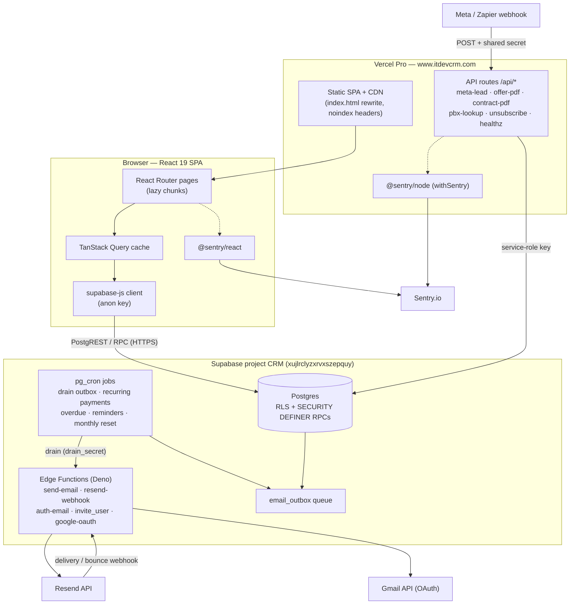

# Architecture

**Purpose** — A high-level map of how ITDevCRM is built and deployed: a React SPA on Vercel talking directly to Supabase Postgres (RLS-guarded) over `supabase-js`, with serverless Vercel API routes, Supabase Edge Functions, Postgres `pg_cron` jobs, Resend for email, and Sentry for monitoring.

## Stack

| Layer | Technology |
|---|---|
| UI framework | React 19 + TypeScript (strict) |
| Build / dev | Vite 8 (`vite`, `vite build`) |
| Routing | `react-router-dom` v7 (`createBrowserRouter`, lazy route chunks) |
| Server state | `@tanstack/react-query` v5 (cache keyed by `src/lib/queryKeys.ts`) |
| Client state | `zustand` (`src/lib/stores/authStore.ts`, `themeStore.ts`) |
| Styling | Tailwind CSS v4 (`@tailwindcss/vite`) + shadcn/ui (Radix primitives) |
| Forms / validation | `react-hook-form` + `zod` (`@hookform/resolvers`) |
| i18n | `i18next` / `react-i18next` (English + Greek; UI labels are largely Greek) |
| Drag & drop | `@dnd-kit` (kanban boards, task board) |
| Charts | `recharts` (dashboard, accounting reports) |
| Docs rendering | `react-markdown` + `remark-gfm` + `mermaid` (in-app documentation pages) |
| PDF / spreadsheets | `jspdf`, `puppeteer-core` + `@sparticuz/chromium` (server PDF), `xlsx` (SheetJS import/export) |
| Backend | Supabase: Postgres + Row-Level Security + `SECURITY DEFINER` RPCs + `pg_cron` |
| Edge runtime | Supabase Edge Functions (Deno) |
| Serverless | Vercel API routes (`@vercel/node`, `api/*.ts`) |
| Email | Resend (transactional) + Gmail send via OAuth for some identities |
| Monitoring | Sentry (`@sentry/react` frontend, `@sentry/node` for API routes) |

## How the pieces connect

- **The browser is the primary backend client.** `src/lib/supabase.ts` creates one `supabase-js` client from `VITE_SUPABASE_URL` + `VITE_SUPABASE_ANON_KEY`. Almost all reads and writes go straight from React → Postgres. There is no bespoke Node API tier in front of the database; **security is enforced by RLS and `SECURITY DEFINER` RPCs**, not by a trusted middle layer.
- **RPCs are the privileged path.** Anything that must bypass or centralize RLS logic (lead conversion, accounting completion, lead-intake release/merge, deletes, kanban pagination counts, global search) is a Postgres function called via `supabase.rpc(...)`. Wrap captured `from`/`rpc` references with `.bind(supabase)` — see `src/lib/rpc.ts`.
- **Vercel API routes** (`api/*.ts`) exist only for work the browser cannot or should not do directly: inbound webhooks (`api/meta-lead.ts`), server-side PDF generation (`api/offer-pdf.ts`, `api/contract-pdf.ts` — these bundle headless Chromium), PBX caller-ID lookup (`api/pbx-lookup.ts`), one-click `api/unsubscribe.ts`, and `api/healthz.ts`. They use the service-role key (server-only env var) and are wrapped with Sentry via `api/_sentry.ts`.
- **Edge Functions** (`supabase/functions/*`) run in Deno and handle email and auth-adjacent flows: `send-email` (renders templates, routes per-department CC, sends via Resend/Gmail), `resend-webhook` (delivery/bounce tracking), `auth-email`, `invite_user`, `google-oauth`.
- **Cron jobs run inside Postgres** via `pg_cron` (not Vercel Cron). They drain the email outbox, renew recurring payments, flag/relocate overdue deals, send payment reminders, reset monthly SEO task checklists, and reconcile block lifecycle. See `environments.md` for the job list.
- **Email is a queue, not a direct send.** App code enqueues into `email_outbox`; a `pg_cron` "drain" job calls the `send-email` edge function. Drain auth uses a dedicated `email_drain_secret` (JWT-decoupled) and has a heartbeat/health RPC surfaced as an in-app admin banner.

## Feature-folder structure

Code is organized by feature under `src/features/<feature>/`, each owning its pages, components, and `hooks/` (React Query hooks). Cross-cutting code lives in `src/lib/` and `src/components/`.

```
src/
  app/            router.tsx, ShellLayout, AdminLayout, RouteError, route guards
  components/     shared UI (shadcn/ui wrappers, auth guards: RequireGroup, AdminGuard)
  features/
    auth/ users/ permissions/ groups/        identity & access
    clients/ contacts/ leads/ sales/         sales side (pipeline, kanban, leads list)
    deals/ accounting/ accounting_report/     accounting (deals, recurring, P&L)
    jobs/ tech/                               technical delivery (per-service job boards)
    offers/ contracts/                        quoting & contracts (PDF)
    tasks/ assigned_tasks/                    personal + delegated tasks
    email/ email_automations/ notifications/  comms
    announcements/ documentation/ dashboard/ home/ search/ activity/ ...
  lib/            supabase.ts, queryKeys.ts, queryClient.ts, rpc.ts, auth.ts, stores/, sentry/
  types/          supabase.ts (generated DB types — `npm run types:gen`)
supabase/
  migrations/     272+ ordered SQL files (source of truth for schema)
  functions/      Deno edge functions
api/              Vercel serverless routes
```

Routes are declared in `src/app/router.tsx`. Every page is `React.lazy`-loaded (one chunk per page) via `importWithRetry` so a stale-chunk 404 after a deploy lands on `RouteError` instead of crashing. Top-level route groups (`/sales`, `/accounting`, `/tech`, `/admin`) are gated by `RequireGroup` / `AdminGuard`.

## Flow / Map



## Gotchas

- **No trusted middle tier.** Because the SPA writes directly to Postgres with the anon key, **every table needs correct RLS** and privileged operations must be `SECURITY DEFINER` RPCs. A missing/overly-broad policy is a real data-exposure bug, not a theoretical one.
- **`.bind(supabase)` on detached method references.** Capturing `const from = supabase.from` (without binding) loses `this` and the call silently throws *before* any network request — no toast, no Sentry, no failed request to debug. Always `.bind(supabase)`. (Burned the leads auto-distribute toggle.)
- **Stale hashed chunks after deploy.** Old browser tabs / cached `index.html` 404 on old hashed JS chunks until a hard refresh. When triaging "X stopped working", check for a stale build first; `RouteError` + `importWithRetry` mitigate but don't eliminate it.
- **Edge functions are not Sentry-instrumented.** Only the frontend and Vercel API routes report to Sentry; edge functions rely on the email-pipeline heartbeat/health RPC + admin banner instead.
- **PDF routes bundle Chromium.** `api/offer-pdf.ts` / `api/contract-pdf.ts` need `includeFiles: node_modules/@sparticuz/chromium/**` in `vercel.json` and a 60s `maxDuration` — easy to forget when adding a new server-PDF route.
- **Cron lives in the DB, not in `vercel.json`.** Don't look for scheduled jobs in Vercel; they are `pg_cron` rows in Postgres (see `environments.md`).

## File references

- `/Users/marios/Desktop/Cursor/itdevcrm/package.json` — stack and scripts
- `/Users/marios/Desktop/Cursor/itdevcrm/src/app/router.tsx` — route map, lazy chunks, route guards
- `/Users/marios/Desktop/Cursor/itdevcrm/src/lib/supabase.ts` — single supabase-js client
- `/Users/marios/Desktop/Cursor/itdevcrm/src/lib/rpc.ts` — RPC helpers (binding pattern)
- `/Users/marios/Desktop/Cursor/itdevcrm/src/lib/queryKeys.ts` — React Query cache keys
- `/Users/marios/Desktop/Cursor/itdevcrm/api/` — Vercel serverless routes (`_sentry.ts`, `meta-lead.ts`, `offer-pdf.ts`, `contract-pdf.ts`, `pbx-lookup.ts`, `unsubscribe.ts`, `healthz.ts`)
- `/Users/marios/Desktop/Cursor/itdevcrm/supabase/functions/` — edge functions (`send-email`, `resend-webhook`, `auth-email`, `invite_user`, `google-oauth`)
- `/Users/marios/Desktop/Cursor/itdevcrm/vercel.json` — rewrites, noindex headers, function config
- `/Users/marios/Desktop/Cursor/itdevcrm/docs/system-analysis/2026-06-17-accounting-and-technical-walkthrough.md` — deep functional reference
