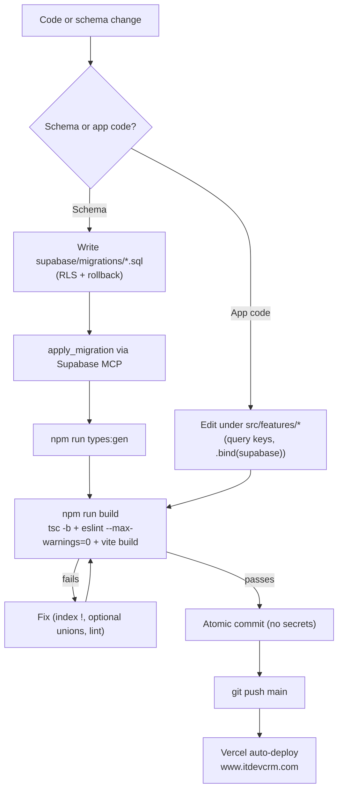

# Conventions

**Purpose** — The non-obvious rules and invariants you must follow when changing this codebase, so a new developer doesn't break billing, security, or the build.

## Schema & database

- **Migrations are the source of truth.** Every schema change is an ordered SQL file in `supabase/migrations/`. Never hand-edit production schema in the dashboard and leave it undocumented — write a migration.
- **Production DDL is applied via the Supabase MCP `apply_migration` tool**, then the matching file is committed. Bulk data fixes (DML) may go through the Supabase Management API with an `sbp_` token, but DDL stays on MCP. (See `environments.md`.)
- **RLS everywhere.** The browser talks to Postgres directly with the anon key, so **every table must have correct Row-Level Security**, and privileged operations are `SECURITY DEFINER` RPCs. Capabilities are checked with `current_user_can(board, action)` (with an `is_admin` super-bypass). When adding a table or RPC, add/verify policies in the same migration. Test RLS by switching roles (the "role-switch RLS-test" technique).
- **Generated columns** are used deliberately (e.g. `leads.phone_normalized` is generated; `lead_intake.phone_normalized` is *not*). Don't try to write a generated column; dedup logic keys on the column, not on `source_data` JSON.
- **Include rollback SQL.** Migrations should carry a revert path (and back up to a `*_backup_<date>` table before destructive data changes) so a change can be undone. Record changes in a "Changes / Revert" section of the spec/plan.
- **Regenerate types after schema changes:** `npm run types:gen` → `src/types/supabase.ts`. (Temporary hand-stubbed types are tolerated only until the CLI-authenticated regen runs.)

## Billing invariants (do not violate)

- **Single source of truth = the deal's accounting stage.** `deals.accounting_stage` drives billing state. Jobs are the work/billing units; `deal_payments` are the scheduled cash. MRR and financial widgets derive from active (non-closed) deals — don't compute billing state from client status or job state.
- **Payment dates entered by accounting are never overwritten.** Recurring renewal and any cron/RPC that touches `deal_payments` must preserve human-entered dates. This is a hard rule — accounting owns those dates.
- **AI SEO billing lives on the parent only.** The `ai_seo` parent job holds the price; its `web_seo`/`local_seo` children (`parent_job_id NOT NULL`) are `amount_net = 0` and must never display the deal amount anywhere (card badge, detail overview, jobs tab).
- **Don't bulk-swap the recurring-payments cron to v2** until €0-amount recurring jobs are backfilled — v2 would bill €0 for the affected deals.

## Frontend

- **`npm run build` is the strict gate.** It runs `tsc -b` (project refs; `tsconfig.app.json` enables `noUncheckedIndexedAccess`) **then** `eslint . --max-warnings=0` **then** `vite build`. This is stricter than `npx tsc --noEmit` against the root config — **always verify with `npm run build`**, not a bare typecheck.
  - With `noUncheckedIndexedAccess`, assert known-valid array indices with `!` (non-null assertion); `no-non-null-assertion` is not enabled.
  - `exactOptionalPropertyTypes` is on — model optional props as a union, don't pass `undefined` to a non-optional field.
  - Tests are type-checked too (`noUnusedLocals` applies); a stray unused local in a test fails the build.
- **`.bind(supabase)` when capturing `from`/`rpc`.** A detached method reference loses `this` and throws before any request — no toast, no Sentry, no network call. Use the helpers in `src/lib/rpc.ts`.
- **One lazy chunk per page** (`src/app/router.tsx` via `importWithRetry`); the `RouteError` boundary catches stale-chunk 404s after a deploy. After deploying, a hard refresh may be needed in old tabs — check stale builds first when triaging "X broke".
- **Server state in React Query, cache keys in `src/lib/queryKeys.ts`.** Add new keys there rather than inlining arrays, so invalidation stays consistent. Client/UI state goes in `zustand` stores (`src/lib/stores/`).
- **Feature-folder ownership.** Put pages/components/hooks under `src/features/<feature>/`; only genuinely cross-cutting code goes in `src/lib/` or `src/components/`.
- **Storage keys must be ASCII.** Wrap any Supabase Storage object key that interpolates a filename with the sanitizer (`src/lib/sanitizeStorageKey.ts`) — Greek filenames otherwise fail with "Invalid key".

## Workflow

- **Push directly to `main`.** No PRs, no feature-branch ceremony — `main` auto-deploys to Vercel. (If your tooling defaults to a branch, that's fine, but the team norm is straight-to-main.)
- **Atomic commits + a "Changes / Revert" note** so any change can be reverted cleanly.
- **No literal secrets in markdown, plans, or migrations** — reference env var / secret *names* only (GitHub push protection scans markdown).
- **Watch for parallel-session git collisions.** Multiple agents/sessions on `main` have repeatedly collided; never `git commit --amend` while another session is active, and rebase before pushing.
- **Read-only until told.** Do not mutate external systems (e.g. ClickUp) or add to the project without an explicit go-ahead — propose first.

## Flow / Map

## Gotchas

- **`npm run build` ≠ `tsc --noEmit`.** The build config is stricter (`noUncheckedIndexedAccess`, ESLint max-warnings=0). Code that "typechecks" can still fail CI/deploy. Always run the real build.
- **A missing RLS policy is a security bug, not a TODO.** There is no trusted API tier to fall back on — the database is the boundary.
- **Touching `deal_payments` is high-stakes.** Preserve accounting-entered dates and respect the deal-accounting-stage source of truth.
- **AI SEO children leaking an amount** is a recurring regression — guard every place a job amount is shown.
- **Secret leakage** via committed markdown/migrations is blocked by push protection but easy to trip; reference names only.

## File references

- `/Users/marios/Desktop/Cursor/itdevcrm/package.json` — `build`, `lint`, `types:gen` scripts (the strict gate)
- `/Users/marios/Desktop/Cursor/itdevcrm/tsconfig.app.json` — `noUncheckedIndexedAccess`, `exactOptionalPropertyTypes`
- `/Users/marios/Desktop/Cursor/itdevcrm/eslint.config.js` — `--max-warnings=0` rule set
- `/Users/marios/Desktop/Cursor/itdevcrm/src/lib/rpc.ts` — `.bind(supabase)` RPC helpers
- `/Users/marios/Desktop/Cursor/itdevcrm/src/lib/queryKeys.ts` — React Query cache-key registry
- `/Users/marios/Desktop/Cursor/itdevcrm/src/lib/sanitizeStorageKey.ts` — storage-key ASCII sanitizer
- `/Users/marios/Desktop/Cursor/itdevcrm/src/app/router.tsx` — lazy chunks + `RouteError` boundary
- `/Users/marios/Desktop/Cursor/itdevcrm/supabase/migrations/` — migrations-as-source-of-truth
- `/Users/marios/Desktop/Cursor/itdevcrm/docs/system-analysis/2026-06-17-accounting-and-technical-walkthrough.md` — billing/stage behavior in depth

## Migration grants checklist (since 2026-07-01)

Default privileges were hardened on 2026-07-01
(`20260701230000_revoke_secdef_fn_grants.sql` + `20260701231000_default_privs_global_public_revoke.sql`):
new functions created by `postgres` get **no** `anon`/`PUBLIC` EXECUTE (global default-ACL entry)
and new tables/sequences in `public` get **no** `anon` grants. `authenticated` and `service_role`
defaults remain open. Every new migration must therefore:

1. **New user-facing RPC** — nothing extra needed for the grant (`authenticated` is default),
   but the function body MUST gate internally (`current_user_is_admin()` / `current_user_can(...)`).
2. **New internal / cron / trigger-helper function** — add
   `revoke execute on function public.<fn>(<args>) from authenticated;`
   (cron runs as `postgres` = owner; triggers check EXECUTE at creation time — neither needs a grant).
3. **New backup / scratch table** — add
   `revoke all on table public.<tbl> from authenticated;` (anon is already closed by default).
4. **RPC called from an edge function / script** — the `service_role` default grant covers it; if you
   revoke broadly, re-grant `service_role` explicitly.

Caveat: objects created by `supabase_admin` (rare — platform tooling, some dashboard operations)
still get the old open defaults; `postgres` cannot alter that role's default ACL. App migrations via
CLI/MCP/mgmt-API all run as `postgres`, so this is acceptable — but if a function is ever created
another way, check its grants.
