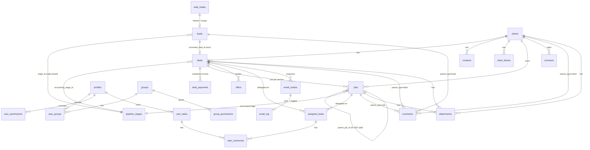

# Data Model

**Purpose** — The core entities and how they relate, so you can navigate the schema without reading 270+ migrations. The spine is **client → deal → (deal_payments, jobs)**, fed upstream by **lead_intake → leads** and configured by **pipeline_stages** + the permissions tables.

## The big picture (in words)

1. **Inbound** leads land in `lead_intake` (a moderated inbox: Meta webhook + CSV/Excel import). An admin **releases** or **merges** them into `leads`.
2. A `lead` lives on the **sales kanban**, owned by a sales rep, positioned by `stage_id → pipeline_stages`.
3. When a lead is **won**, `convert_lead_to_client` creates a `client` and a `deal` in one step (and back-links `leads.converted_deal_id`).
4. A `deal` is the **billing + work unit**. It sits on the **accounting onboarding board** (positioned by `accounting_stage_id → pipeline_stages`). Its `accounting_stage` is the single source of truth for billing state.
5. The deal seeds **`deal_payments`** (scheduled income rows; recurring rows are renewed by cron) and spawns **`jobs`** — one job per service sold.
6. `jobs` are the technical-delivery cards on the per-service boards (`web_seo`, `local_seo`, `web_dev`, `social_media`, `hosting`, `ads`). `jobs.parent_job_id` models the **AI SEO 3-row split** (one billing-only parent + a web child + a local child).
7. Communication and work-tracking attach across entities: `comments`, `attachments`, `activity_log`, `notifications`, `user_tasks` / `assigned_tasks`, and the `email_*` tables.

## Core tables

| Table | Purpose |
|---|---|
| `profiles` | One row per app user (mirrors `auth.users`); name, email, flags like `exclude_from_lead_distribution`. |
| `groups` / `user_groups` | Departments/roles (sales, accounting, web_seo, local_seo, web_dev, social_media, hosting, ads, ai_seo); membership join. |
| `group_permissions` / `user_permissions` / `field_permissions` | RLS/UI capability grants per group, per-user overrides, and per-field rules. Checked via `current_user_can(board, action)` with an admin super-bypass. |
| `pipeline_stages` | Every board's columns (sales, accounting onboarding, each tech board). A stage carries a `board`, `code`, ordering, and color. |
| `lead_intake` | Moderated inbox for inbound leads (Meta + import). Dedup against `leads`/clients; admin Release/Merge/Discard. `phone_normalized` is plain here. |
| `leads` | Sales pipeline records. `stage_id`, `owner` (rep), `converted_deal_id`, `intake_log`, generated `phone_normalized`. |
| `clients` | Customer accounts. `status` (new/active/blocked/done), country (drives VAT), block state. |
| `contacts` | People attached to a client. |
| `deals` | The billing + work unit. `client_id`, `accounting_stage_id`, `services_planned` JSONB, `won_by_user_id`, `invoiced_date`, `locked_at`, `accounting_completed_at`. |
| `deal_payments` | Scheduled income per deal: `billing_type` (one_time / recurring_monthly / recurring_yearly), `amount`, `start_date`, `status`, `paid_at`, `invoice_number`. |
| `jobs` | One technical-delivery card per service sold. `service_type`, `client_id`, `deal_id`, `parent_job_id` (AI SEO split), `code` (`<dealcode>-<SERVICE>`), `amount_net`, `is_blocked`, `details` JSONB (creds/URLs/notes), `owner`. |
| `service_packages` / `service_subpackages` | Catalog of sellable services used when planning a deal. |
| `service_monthly_task_templates` | Per-service monthly checklist templates (SEO services) reset by cron. |
| `offers` | Quotes built for a lead/deal (PDF via Vercel route). |
| `contracts` / `contract_templates` | Generated client contracts (PDF). |
| `user_tasks` | Personal/calendar tasks (created by/for a user); optional `client_id`. |
| `assigned_tasks` | Delegated tasks tied to a deal or job (carry `client_id` via trigger). |
| `task_comments` | Parties-only comments on tasks (separate from the open `comments` table). |
| `comments` | Open-to-all-staff threaded comments; `parent_type` ∈ client/deal/job/lead. |
| `attachments` | Uploaded files keyed to a parent entity; storage keys are ASCII-sanitized. |
| `activity_log` | Audit trail; actor captured for direct in-app edits (crons/RPCs show "System"). |
| `notifications` | In-app notifications (mentions, task events, assignments). |
| `announcements` (+ dismissals) | Admin broadcast pop-ups. |
| `email_templates` | Authoritative editable email bodies (per `key`). |
| `email_outbox` | Queue of emails to send; drained by `pg_cron` → `send-email`. |
| `email_log` | Sent/delivered/bounced/complained record (also used for idempotency dedup). |
| `email_automation_settings` | Per-department toggles (sales/accounting/technical) + global gate. |
| `email_sequences` / `email_sequence_steps` / `lead_sequence_runs` | Scheduled multi-step email sequences (e.g. payment reminders). |
| `expenses` / `expense_categories` | Cost side of the P&L report. |
| `client_blocks` | Client-level block records (one of three "blocked" mechanisms; see lifecycle notes). |

> Tip: the authoritative, always-current table/column/RPC list is the generated `src/types/supabase.ts` (regenerate with `npm run types:gen`). Treat the table above as the orientation map, not the source of truth.

## Flow / Map

## Gotchas

- **The deal is the billing unit, not the client.** `deals.accounting_stage` is the single source of truth for billing state; `deal_payments` are the scheduled cash, and MRR/financials derive from active (non-closed) deals. Don't infer billing state from client status.
- **AI SEO is a 3-row job split.** One `ai_seo` parent holds the price (`billing_only`, unowned), with a `web_seo` child and a `local_seo` child linked by `jobs.parent_job_id` (FK cascade). **Children must never show the deal amount** (`amount_net = 0`; identify via `parent_job_id NOT NULL`). The teams can't see the `ai_seo` parent — files live on the children.
- **`phone_normalized` is generated on `leads` but plain on `lead_intake`.** Dedup keys on the email/`phone_normalized` *columns*, not on `source_data`. ClickUp/Meta imports historically stranded email/phone under Greek keys and sent `0000000000` placeholders — handled in the import parser, but watch for it.
- **Three separate "blocked" mechanisms.** `clients.status`, `jobs.is_blocked` + `reason`, and `client_blocks` are distinct. On-Hold deals hold only `web_seo`/`local_seo`/`ai_seo` jobs (via trigger, reason `account_on_hold`).
- **Payment dates entered by accounting are never overwritten.** Recurring renewal/cron logic must preserve human-entered dates on `deal_payments`. See `conventions.md`.
- **Two task tables.** `user_tasks` (personal/calendar) vs `assigned_tasks` (delegated on a deal/job). Home/client widgets union both. Comments use the parties-only `task_comments`, not the open `comments` table.
- **`activity_log` mostly shows "System".** Actor is only captured for direct in-app edits (~97% of rows are crons/imports/RPCs/service-role with no user).

## File references

- `/Users/marios/Desktop/Cursor/itdevcrm/src/types/supabase.ts` — generated DB types (authoritative table/column/RPC list)
- `/Users/marios/Desktop/Cursor/itdevcrm/supabase/migrations/20260502000007_clients.sql` — clients
- `/Users/marios/Desktop/Cursor/itdevcrm/supabase/migrations/20260502000008_deals_jobs.sql` — deals + jobs
- `/Users/marios/Desktop/Cursor/itdevcrm/supabase/migrations/20260503000010_deal_payments.sql` — deal_payments
- `/Users/marios/Desktop/Cursor/itdevcrm/supabase/migrations/20260502000017_leads_table.sql` — leads
- `/Users/marios/Desktop/Cursor/itdevcrm/supabase/migrations/20260502000002_pipeline_stages.sql` — pipeline_stages
- `/Users/marios/Desktop/Cursor/itdevcrm/supabase/migrations/20260502000003_permissions_tables.sql` — permissions tables
- `/Users/marios/Desktop/Cursor/itdevcrm/supabase/migrations/20260502000005_permissions_engine.sql` — `current_user_can` engine
- `/Users/marios/Desktop/Cursor/itdevcrm/src/lib/queryKeys.ts` — cache keys mirroring the entity graph
- `/Users/marios/Desktop/Cursor/itdevcrm/docs/system-analysis/2026-06-17-accounting-and-technical-walkthrough.md` — entity-by-entity functional reference
