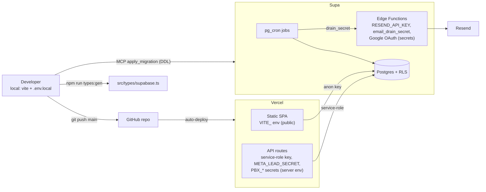

# Environments

**Purpose** — Where the app runs, how it's deployed, where the schema changes come from, and how secrets and scheduled jobs are configured. **No secret values appear in this doc — secrets are referenced by name only.**

## Hosting & deploy

| Concern | Detail |
|---|---|
| Frontend host | **Vercel Pro** (paid via the agency account) |
| Production domain | **www.itdevcrm.com** (canonical) |
| Deploy model | **Push to `main` → Vercel auto-builds and deploys.** No PR/feature-branch ceremony (see `conventions.md`). |
| SPA routing | `vercel.json` rewrites everything (except `/api`, assets, `robots.txt`, `llms.txt`) to `/index.html`. |
| Indexing | The app is **private**: `X-Robots-Tag: noindex, nofollow, noarchive, ...` on every response (`vercel.json`) and `public/robots.txt` `Disallow: /` for `*` plus every named AI/LLM crawler (GPTBot, ClaudeBot, PerplexityBot, Google-Extended, Bytespider, etc.). |
| Serverless functions | Vercel API routes under `api/*.ts`. PDF routes (`offer-pdf`, `contract-pdf`) run headless Chromium (`maxDuration: 60`, `includeFiles` Chromium); `pbx-lookup` / `meta-lead` are `maxDuration: 10`. |

## Backend (Supabase)

| Concern | Detail |
|---|---|
| Project name | **CRM** |
| Project ref | **`xujlrclyzxrvxszepquy`** |
| Surface | Postgres (RLS), PostgREST (used by `supabase-js`), Edge Functions (Deno), `pg_cron`, Storage |
| Edge functions | `send-email`, `resend-webhook`, `auth-email`, `invite_user`, `google-oauth`. The client-facing email senders run with `verify_jwt: false` (drain/webhook are not user-authenticated). |
| Storage | Attachment buckets; object keys must be ASCII (Greek filenames are sanitized before upload). |

### Migrations are applied via the Supabase MCP

- The migration files in `supabase/migrations/` are the **source of truth** for schema.
- **Production DDL is applied through the Supabase MCP `apply_migration` tool**, not psql/CLI from a laptop. (Bulk DML reads/writes can go through the Supabase Management API with an `sbp_` token; DDL is intentionally restricted to MCP.)
- Regenerate the TypeScript types after schema changes: `npm run types:gen` (writes `src/types/supabase.ts`; the project id is baked into the script).

### Cron jobs run in Postgres (`pg_cron`)

Scheduled work is **not** Vercel Cron — it is `pg_cron` rows inside the database. Current jobs include:

| Job (approx name) | What it does |
|---|---|
| `drain_email_outbox` | Drains `email_outbox` → calls the `send-email` edge function (auth via `email_drain_secret`). |
| `recover_stale_email_claims` | Releases stuck outbox claims so a crashed drain doesn't strand emails. |
| `ensure_recurring_payments` (v1) | Renews recurring `deal_payments` (copies the amount forward). **Do not swap to v2 yet** — €0-amount recurring jobs would bill €0. |
| `mark_overdue_payments` / `move_overdue_deals_to_on_hold` | Flags overdue payments and moves overdue deals to On Hold. |
| Payment-reminder sequence | Emails clients reminders around the payment date (−7 / +1 / +7), department-gated, with suppression flags. |
| `run_monthly_task_reset` | Resets per-service monthly SEO checklists. |
| `ensure_recurring_expenses` | Renews recurring expense rows for the P&L. |
| `reconcile_block_lifecycle` | Reconciles the client/job/On-Hold block mechanisms. |

## Secrets & configuration (by name — never values)

### Frontend build-time (Vite, `VITE_` prefix → public in the bundle)

- `VITE_SUPABASE_URL`
- `VITE_SUPABASE_ANON_KEY`

These are intentionally public (the anon key is RLS-guarded). See `.env.example`; local dev uses `.env.local`.

### Vercel environment variables (server-only, for API routes)

- Supabase **service-role key** (server only — never shipped to the browser)
- `META_LEAD_SECRET` — shared secret for the Meta/Zapier lead webhook (sent in the query, not headers)
- `PBX_LOOKUP_SECRET` — Yeastar caller-ID lookup
- `PBX_DEEPLINK_BASE` — base URL for the PBX deep-link back into the CRM
- Sentry DSN / auth (frontend + API-route reporting)

### Supabase secrets (Edge Function env, server only)

- `RESEND_API_KEY` — Resend transactional email
- `email_drain_secret` — authenticates the cron drain → `send-email` (JWT-decoupled)
- Google OAuth client credentials + token-encryption key (Gmail send, `google-oauth`)
- Supabase service-role key (for functions that need elevated DB access)

> **Rule:** put secret *values* only in the Vercel env UI or Supabase secrets — never in markdown, migrations, or committed `.env` files. GitHub push protection scans markdown for secrets. Rotate any token shared in a chat before go-live.

## Flow / Map

## Gotchas

- **Anything `VITE_`-prefixed is public.** It ships in the client bundle. Only the anon key (RLS-protected) belongs there — never the service-role key.
- **`verify_jwt: false` must stay off for the email senders.** Redeploying `send-email` via MCP must preserve `verify_jwt: false` (all of its files), or the cron drain/webhook calls start failing.
- **DDL goes through MCP, not the laptop.** Don't try to apply production schema with a local CLI/psql; use the Supabase MCP `apply_migration`. Management-API tokens are for DML only.
- **`META_LEAD_SECRET` lives in the query string, not headers.** A blank value in Vercel silently 401s the Zapier webhook (this happened once).
- **Cron is invisible in Vercel.** Scheduled jobs are `pg_cron` in Postgres; look there, not in `vercel.json`, when a scheduled task misbehaves. The email pipeline has its own heartbeat/health RPC + in-app admin banner because a drain outage was silent for a week.
- **`robots.txt` + noindex are load-bearing.** This is a private internal app; do not remove the crawler blocks or the `X-Robots-Tag` header.

## File references

- `/Users/marios/Desktop/Cursor/itdevcrm/vercel.json` — rewrites, noindex headers, function durations, Chromium includeFiles
- `/Users/marios/Desktop/Cursor/itdevcrm/public/robots.txt` — crawler / AI-bot blocks
- `/Users/marios/Desktop/Cursor/itdevcrm/.env.example` — required env var names (no values)
- `/Users/marios/Desktop/Cursor/itdevcrm/package.json` — `types:gen` script (project id `xujlrclyzxrvxszepquy`)
- `/Users/marios/Desktop/Cursor/itdevcrm/supabase/functions/send-email/` — drain target; `RESEND_API_KEY` usage
- `/Users/marios/Desktop/Cursor/itdevcrm/supabase/migrations/20260616000004_payment_reminder_sequence.sql` — payment-reminder cron sequence
- `/Users/marios/Desktop/Cursor/itdevcrm/supabase/migrations/20260625150000_email_drain_claim_infra.sql` — outbox claim/recover cron
