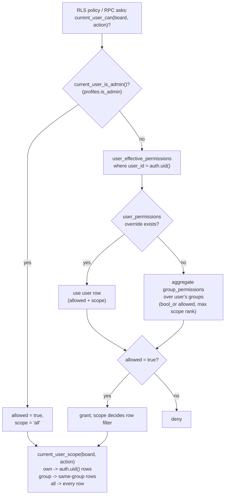

# Auth & Permissions

**Purpose** — How the CRM resolves "can this user do X on board Y, and over which rows": a two-layer capability engine (group defaults + per-user overrides) plus an admin bypass, all enforced in Postgres via `SECURITY DEFINER` helper functions used in RLS policies.

## Data model

- **`profiles`** — one row per `auth.users` (FK `user_id`). Key cols: `is_admin` (the global bypass), `is_active`, `must_change_password`, `archived`, `preferred_locale`. Created automatically by the `on_auth_user_created` trigger. Privileged columns (`is_admin`, `is_active`, `archived*`) are revoked from `authenticated` so a user can't self-escalate; `service_role` has full access.
- **`groups`** — operational departments (`code` unique: `sales`, `accounting`, `web_seo`, `local_seo`, `web_dev`, `social_media`; later also `ai_seo`, `hosting`, `ads`). `display_names` jsonb (en/el), `parent_label` (`Sales`/`Accounting`/`Technical`).
- **`user_groups`** — many-to-many `(user_id, group_id)`.
- **`group_permissions`** (Layer 1) — per-group default capability: `(group_id, board, action)` unique, `scope` ∈ `own`|`group`|`all`, `allowed`.
- **`user_permissions`** (Layer 2) — per-user override: `(user_id, board, action)` unique, `scope`, `allowed`. Overrides the group layer (allow OR deny).
- **`field_permissions`** (Layer 3) — `hidden`/`readonly` per `(scope_type, scope_id, table_name, field_name)` (UI-level field gating).
- **`user_effective_permissions`** (view) — resolves layers 1+2 into `(user_id, board, action, allowed, scope)`, returning only `allowed=true` rows with the **highest** scope (`all`>`group`>`own`).

A **capability** is the triple `board` (e.g. `sales`, `accounting_onboarding`, `web_seo`, `clients`) × `action` (`view`, `create`, `edit`, `move_stage`, `comment`, `attach_file`, `assign_owner`, `complete_job`, `complete_accounting`, `block_client`, …) × `scope` (`own`|`group`|`all`).

## Flow

## Functions / triggers / crons

- **`current_user_is_admin()`** — `select coalesce((select is_admin from profiles where user_id = auth.uid()), false)`. `STABLE SECURITY DEFINER`. The single source of the admin bypass; referenced directly in nearly every table's RLS.
- **`current_user_can(board, action) → boolean`** — `is_admin OR exists(row in user_effective_permissions for auth.uid() with allowed=true)`. The primary capability gate.
- **`current_user_scope(board, action) → text`** — `'all'` for admins, else the highest `scope` granted for that capability (`all`>`group`>`own`); RLS uses it to widen/narrow the row filter.
- **`user_effective_permissions`** (view) — `full outer join` of aggregated `group_permissions` and `user_permissions`; the user override wins when present, otherwise the group's `bool_or(allowed)` + max scope rank.
- **`handle_new_auth_user()`** + trigger `on_auth_user_created` (AFTER INSERT on `auth.users`) — inserts the `profiles` row from auth metadata (`full_name`, `must_change_password`), `on conflict do nothing`.
- **`set_updated_at()`** — shared `updated_at` stamp trigger on these tables.
- **Frontend mirror**: `useAuthStore` exposes `isAdmin`; `useAuthListener` calls `Sentry.setUser` on sign-in/out. Capability checks in the UI are advisory — the DB RLS is authoritative.
- Seed: `20260502000006_seed_default_permissions.sql` grants each group its baseline (sales gets sales-board create/edit/move/comment/etc. at `group` scope; accounting gets the accounting boards at `all`; tech sub-departments edit their own board at `group`; all groups get `clients:view`).

## Gotchas

- **`is_admin` is a hard bypass** — `current_user_is_admin()` short-circuits both `current_user_can` and `current_user_scope` to full `all` access regardless of any group/user rows. Granting admin sidesteps the whole capability engine.
- **All capability helpers are `SECURITY DEFINER`** — they read permission tables on behalf of the caller, so RLS on those tables doesn't recurse. `current_user_can` is callable from any RLS policy without self-referential RLS loops. (See the monitoring/global-search notes about computing access **once** in heavy RPCs to avoid per-row RLS re-evaluation.)
- **Scope is a separate question from permission.** `current_user_can` says yes/no; `current_user_scope` says over which rows. A policy must check **both** — granting `view` without honoring `scope` would leak rows. `own`=`auth.uid()` rows, `group`=same-group rows, `all`=everything.
- **User override beats group, in both directions** — a `user_permissions` row with `allowed=false` revokes a capability the group grants. The view's full-outer-join takes the user row when it exists.
- **`view_all` is a per-user grant**, not a flag — e.g. the sales manager sees all leads via a `sales`/`view`/`all` row in `user_permissions`, not via `is_admin`. Don't conflate "sees everything" with "is admin".
- Profiles are **soft-deleted** (`archived`), never hard-deleted from the app; deleting an `auth.users` row cascades to the profile. FK cleanup is required before removing a user that owns leads/tasks/etc.
- The `email_*`, `notifications`, and most feature tables gate **writes** behind `current_user_is_admin()` or a capability and gate **reads** with `to authenticated using (true)` only where data is non-sensitive — check the specific table's policy before assuming a board scope applies.

## File references

- `/Users/marios/Desktop/Cursor/itdevcrm/supabase/migrations/20260502000001_profiles_groups.sql`
- `/Users/marios/Desktop/Cursor/itdevcrm/supabase/migrations/20260502000003_permissions_tables.sql`
- `/Users/marios/Desktop/Cursor/itdevcrm/supabase/migrations/20260502000005_permissions_engine.sql`
- `/Users/marios/Desktop/Cursor/itdevcrm/supabase/migrations/20260502000006_seed_default_permissions.sql`
- `/Users/marios/Desktop/Cursor/itdevcrm/src/features/auth/hooks/useAuthListener.ts`
