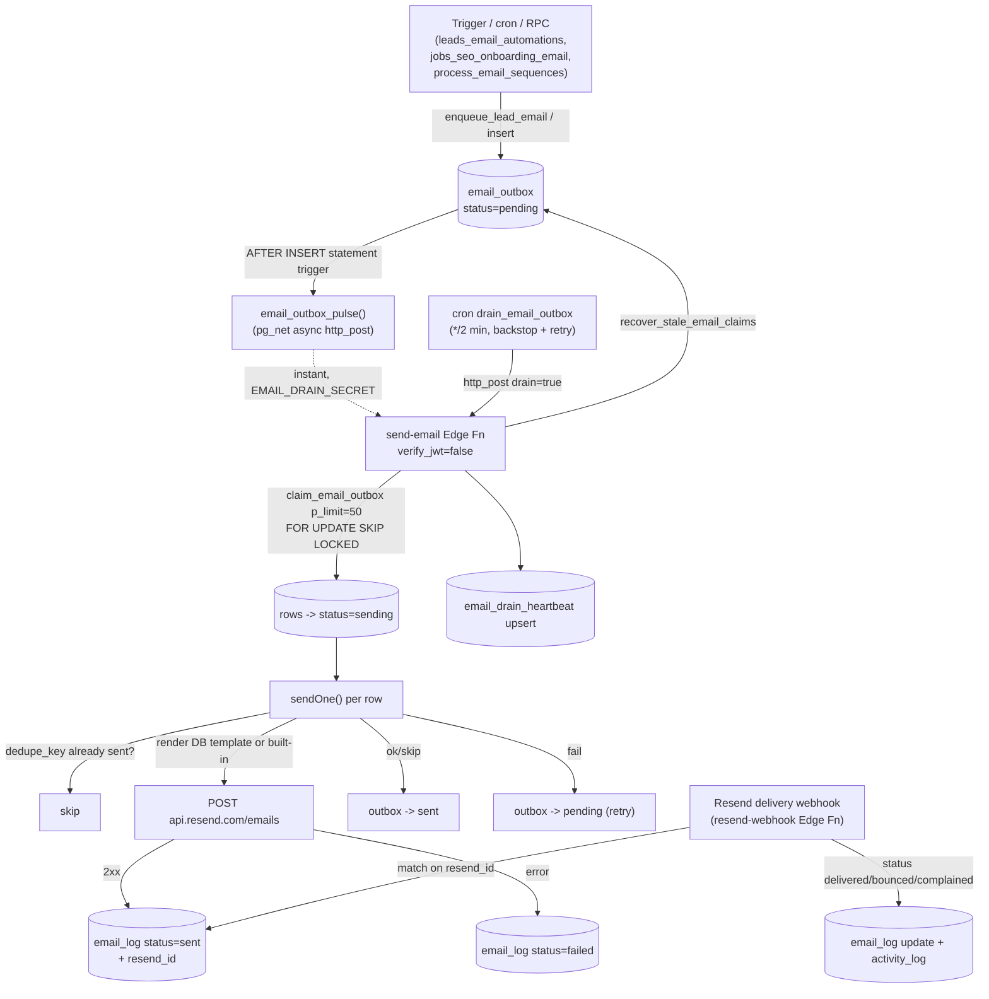

# Email System

**Purpose** — Asynchronous, idempotent transactional/lifecycle email: callers enqueue rows into `email_outbox`, a service-role Edge Function drains them through Resend, and every attempt is audited in `email_log`. Sending is gated by per-department + per-automation toggles.

## Data model

- **`email_outbox`** — the send queue. Key cols: `identity` (`sales`|`accounting`|`internal`), `to_email`, `template_key`, `data` (jsonb payload for `{{var}}` interpolation), `dedupe_key`, `status` (`pending`|`sending`|`sent`|`failed`), `attempts` (capped at 5), `claimed_at`, `last_error`, `sent_at`. Partial index `email_outbox_pending` on `created_at where status='pending'`.
- **`email_log`** — audit + idempotency, one row per attempt. Key cols: `identity`, `to_email`, `template_key`, `resend_id`, `status` (`sent`|`failed`|`delivered`|`bounced`|`complained`), `dedupe_key`, `error`, `client_id` (resolved from `to_email`), `delivered_at`, `bounced_at`. **Unique index** `email_log_dedupe_sent` on `(dedupe_key) where dedupe_key is not null and status='sent'` → a given logical email is `sent` at most once.
- **`email_templates`** — admin-editable templates (PK `key`): `subject`, `body` (plain text, `{{var}}` placeholders, newlines → ` `, bare URLs auto-linkified), `variables`, `client_facing`. Read **first** by `send-email`; built-in `templates.ts` is the fallback (and the only path for `custom`/`internal_*`).
- **`email_automation_settings`** — on/off switches (PK `key`, `enabled`). Three layers of keys: master `global` (gates internal/staff keys), department masters `dept_sales`/`dept_accounting`/`dept_technical` (gate client keys, default OFF), and per-automation keys (`lead_welcome`, `won_welcome`, `webseo_gsc`, `scheduled_reminder`, …).
- **`email_sequences`** / **`email_sequence_steps`** / **`lead_sequence_runs`** — multi-step lead cadences (`no_answer`, `offer_sent`, `reengage`) with editable `day_offset`; one active run per `(lead, sequence)` via partial unique index.
- **`email_drain_heartbeat`** — singleton row (`id boolean primary key`) the drain upserts each run: `last_run_at`, `last_ok_at`, `processed`, `sent`, `failed`. Powers health/banner (see monitoring doc).
- **`leads`** columns: `email_opt_out`, `automations_enabled`, `unsubscribe_token`.

## Flow

## Functions / triggers / crons

- **`send-email` Edge Function** (`supabase/functions/send-email/index.ts`, `verify_jwt=false`). Modes by POST body:
  - `{drain:true}` — service-role/`EMAIL_DRAIN_SECRET` only; runs `drain()`.
  - `{identity:'personal',...}` — sends as the connected user via Gmail (`user_google_accounts`, OAuth refresh), requires a user JWT.
  - single-send (`identity`/`to`/`templateKey`) — service role OR any authenticated staff user.
  - `drain()`: calls `recover_stale_email_claims` → `claim_email_outbox(50)` → `sendOne()` per row → marks outbox `sent`/`pending` → upserts heartbeat.
  - `sendOne()`: dedupe check on `email_log`, render (DB template first), department CC/From routing, POST to Resend, write `email_log`. Honors `EMAIL_DRY_RUN`.
- **`email_outbox_pulse()`** + trigger `email_outbox_pulse` (AFTER INSERT, **FOR EACH STATEMENT**) — fires one async `pg_net` `http_post` drain on enqueue using `email_drain_secret` from Vault; wrapped in `begin…exception when others then null` so a pulse failure never rolls back the caller. Bulk inserts beyond 50 rows fall to the cron backstop.
- **`claim_email_outbox(p_limit)`** (security definer) — atomically flips up to `p_limit` `pending` rows (`attempts<5`) to `sending`, bumps `attempts`, `FOR UPDATE SKIP LOCKED` so concurrent drains take disjoint sets. Revoked from anon/authenticated.
- **`recover_stale_email_claims(interval=5m)`** — resets rows stuck in `sending` past the interval back to `pending`.
- **`email_automation_enabled(key)`** — the gate. For **client keys** (`email_setting_department(key)` not null): `dept_X master AND per-key`. For **internal keys** (department null): `global master AND per-key`.
- **`email_setting_department(key)`** — maps each key to `sales`/`accounting`/`technical`/null.
- **`enqueue_lead_email(lead_id, tpl, dedupe)`** — inserts an outbox row iff lead is active, has email, not opted out, `automations_enabled`, and the dedupe_key isn't already pending/sent.
- **`lead_email_payload(lead)`** — builds the shared `{{var}}` payload (`code`, `name`, `company`, `owner_name`, `scheduled_for`, `unsubscribe_token`, …).
- **`leads_email_automations()`** — triggers `trg_leads_email_automations_ins`/`_upd` on `leads`: welcome on insert (source `manual`/`meta`); on stage change starts/stops sequence runs and fires `won_welcome`/`won_next_steps`; `scheduled_confirm` on `scheduled_for` change.
- **`jobs_seo_onboarding_email()`** + trigger on `jobs` AFTER INSERT — enqueues `webseo_gsc_access` (web_seo) / `localseo_gbp_access` (local_seo) onboarding emails; one per deal per service via dedupe `setting_key:deal_id`.
- **`email_log_set_client_id()`** (BEFORE INSERT) — resolves `client_id` from `to_email`. **`log_email_activity()`** (AFTER INSERT/UPDATE) — writes client-linked send/delivery events to `activity_log`.
- **Crons**: `drain_email_outbox` (`*/2 * * * *`, pg_net pulse to `send-email`, auth = Vault `email_drain_secret`); `process_email_sequences` (`30 6 * * *`, daily cadence/reminder/no-show processor, gated on `dept_sales`); `recover_stale_email_claims` (`*/5 * * * *`).
- **`resend-webhook` Edge Function** — verifies Svix HMAC signature, maps `email.delivered`/`bounced`/`complained` → `email_log` status update keyed on `resend_id` (`email.sent`/`opened`/`clicked` ignored).

## Gotchas

- **`send-email` runs with `verify_jwt=false`** (so the pulse/cron can call it without a JWT, and rotation/migration is safe). Don't casually redeploy: re-deploy must keep `verify_jwt:false` and ship all files in `supabase/functions/send-email/` or the live pipeline breaks.
- The instant pulse uses Vault secret **`email_drain_secret`** (not the service-role key); the `*/2 min` cron also uses it (was repointed off JWT in `20260615000004`). `EMAIL_DRAIN_SECRET` env on the function must equal the Vault value.
- Department toggles default **OFF**. Internal keys still use the legacy `global` master, so internal/staff emails are unaffected by department switches. While a department (or `global`) is off, triggers enqueue **nothing** — paused automations never pulse.
- Idempotency is double-guarded: the `email_log_dedupe_sent` unique index **and** the `sendOne()` pre-check; `enqueue_lead_email`/`jobs_seo_onboarding_email` also skip if a matching `pending`/`sent` row exists. A re-fired trigger is therefore safe.
- `email_log.status` CHECK had to be widened to allow `delivered`/`bounced`/`complained` (`20260625110400`) — Resend webhook updates were being rejected in prod before this.
- Technical onboarding emails (`webseo_gsc_access`/`localseo_gbp_access`) are routed **From `support@itdev.gr`** and CC'd to support, overriding the `accounting` identity they're enqueued with. `accounting`-identity emails CC `accounting@`; sales lifecycle emails CC the lead's `owner_email`.
- Every client-facing subject is prefixed `{{code}} - ` (`20260624090000`); the `code` must be present in the outbox `data` or the prefix renders blank.

## File references

- `/Users/marios/Desktop/Cursor/itdevcrm/supabase/functions/send-email/index.ts`
- `/Users/marios/Desktop/Cursor/itdevcrm/supabase/functions/send-email/identities.ts`
- `/Users/marios/Desktop/Cursor/itdevcrm/supabase/functions/send-email/templates.ts`
- `/Users/marios/Desktop/Cursor/itdevcrm/supabase/functions/resend-webhook/index.ts`
- `/Users/marios/Desktop/Cursor/itdevcrm/supabase/functions/resend-webhook/verify.ts`
- `/Users/marios/Desktop/Cursor/itdevcrm/supabase/migrations/20260602000001_email_tables.sql`
- `/Users/marios/Desktop/Cursor/itdevcrm/supabase/migrations/20260602000002_email_drain_cron.sql`
- `/Users/marios/Desktop/Cursor/itdevcrm/supabase/migrations/20260610000006_email_automations_schema.sql`
- `/Users/marios/Desktop/Cursor/itdevcrm/supabase/migrations/20260610000007_email_automations_engine.sql`
- `/Users/marios/Desktop/Cursor/itdevcrm/supabase/migrations/20260615000004_drain_uses_drain_secret.sql`
- `/Users/marios/Desktop/Cursor/itdevcrm/supabase/migrations/20260624080000_seo_onboarding_emails.sql`
- `/Users/marios/Desktop/Cursor/itdevcrm/supabase/migrations/20260624090000_email_subject_client_code.sql`
- `/Users/marios/Desktop/Cursor/itdevcrm/supabase/migrations/20260624110000_email_department_toggles.sql`
- `/Users/marios/Desktop/Cursor/itdevcrm/supabase/migrations/20260625110000_email_log_client_delivery.sql`
- `/Users/marios/Desktop/Cursor/itdevcrm/supabase/migrations/20260625110100_email_log_link_client.sql`
- `/Users/marios/Desktop/Cursor/itdevcrm/supabase/migrations/20260625110200_email_log_activity_funnel.sql`
- `/Users/marios/Desktop/Cursor/itdevcrm/supabase/migrations/20260625110400_email_log_status_delivery_values.sql`
- `/Users/marios/Desktop/Cursor/itdevcrm/supabase/migrations/20260625150000_email_drain_claim_infra.sql`
- `/Users/marios/Desktop/Cursor/itdevcrm/supabase/migrations/20260625150002_email_instant_pulse.sql`
- `/Users/marios/Desktop/Cursor/itdevcrm/src/features/email_automations/EmailAutomationsPage.tsx`
