# Integrations

**Purpose** — External-system entry/exit points: inbound Meta lead-ad ingestion via Zapier, Yeastar PBX caller-ID lookup + click-to-call, and Resend for outbound email. All HTTP endpoints are shared-secret gated and run on Vercel serverless or Supabase Edge.

## Data model

- **`lead_intake`** — holding queue every inbound lead lands in (Meta webhook + CSV/Excel import). Key cols: `source` (`meta`/`import`), `source_data` (raw payload, secret stripped), `title`, `contact_first_name`/`_last_name`, `email`, `phone`, `phone_normalized`, `website`, `company_name`, `contact_info` (notes), `matched_on` (text[]), `matches` (jsonb of dup hits). Reviewers Release → `leads` (Unique Lead) or Discard.
- **`leads`** / **`clients`** — `phone_normalized` is a **generated** column (`right(regexp_replace(phone,'[^0-9]','','g'),10)` — Greek national 10-digit key) with indexes; `clients.additional_contacts` jsonb also carries phones the PBX matcher scans. `leads.source_data->>leadgen_id` is the Meta dedup key.
- **`email_log`** — stores Resend message id (`resend_id`) and delivery lifecycle (see email-system doc).
- Secrets (env / Vault): `META_LEAD_SECRET`, `PBX_LOOKUP_SECRET`, `PBX_DEEPLINK_BASE`, `RESEND_API_KEY`, `RESEND_WEBHOOK_SECRET`, `SUPABASE_SERVICE_ROLE_KEY`.

## Flow

```mermaid
flowchart TD
  subgraph "Meta leads (inbound)"
    META["Meta lead ad"] --> ZAP["Zapier"]
    ZAP -->|"GET/POST /api/meta-lead?key=&fields"| MFN["api/meta-lead.ts<br/>(Vercel, maxDuration 10)"]
    MFN -->|secret check x-meta-secret/key| MFN
    MFN -->|"parse: named-field OR COL$ columnar"| MFN
    MFN -->|"dedup on source_data.leadgen_id<br/>(leads + lead_intake)"| DD{dupe?}
    DD -->|yes| RET["200 deduped"]
    DD -->|no| FLD["find_lead_duplicates RPC<br/>(flag email/phone matches)"]
    FLD --> INTK[("lead_intake (held)")]
  end
  subgraph "Yeastar PBX"
    CALL["inbound call"] --> YEAST["Yeastar PBX"]
    YEAST -->|"GET /api/pbx-lookup?phone=&key="| PFN["api/pbx-lookup.ts<br/>(Vercel, maxDuration 10)"]
    PFN -->|secret check x-pbx-secret/key| PFN
    PFN -->|"normalizePhone -> 10-digit key"| FCP["find_contact_by_phone RPC<br/>(security definer)"]
    FCP -->|"client primary / additional_contacts / lead"| HIT{match?}
    HIT -->|yes| YC["200 Yeastar { contact } + deeplink url"]
    HIT -->|no| M404["404 not found"]
    AGENT["agent UI: CallLink (tel:)"] -->|click-to-call| SOFT["softphone dials"]
  end
  subgraph "Resend (outbound)"
    SEND["send-email Edge Fn"] -->|POST| RESEND["api.resend.com"]
    RESEND -->|"webhook (Svix HMAC)"| RW["resend-webhook Edge Fn"]
    RW --> EL[("email_log delivery status")]
  end
```

## Functions / triggers / crons

- **`api/meta-lead.ts`** (Vercel serverless, `maxDuration 10`, `withSentry('meta-lead', …)`). Accepts GET (query) or POST (JSON). Secret via `x-meta-secret` header **or** `key` query param, length-checked then exact-compared. Two parse paths: the **named-field resolver** (`pick()` exact-then-fuzzy, handles Greek Meta form labels) and `parseColumnarMetaLead()` for the positional `COL$A..COL$S` Meta→Excel→Zapier format. Dedups on `source_data->>leadgen_id` across both `leads` and `lead_intake`; runs `find_lead_duplicates` to flag email/phone collisions; inserts a held `lead_intake` row. Raw payload stored in `source_data` (the `key` secret deleted first).
- **`api/pbx-lookup.ts`** (Vercel serverless, `maxDuration 10`, `withSentry('pbx-lookup', …)`). Secret via `x-pbx-secret`/`key`. `normalizePhone()` strips to the last 10 digits; calls **`find_contact_by_phone(p_key)`** and returns Yeastar's `{ contact: {…, url } }` envelope (deeplink to `/clients/:id` or `/leads/:id`, base from `PBX_DEEPLINK_BASE`/`VITE_PUBLIC_APP_URL`), or `404` on a miss.
- **`find_contact_by_phone(p_key)`** (`STABLE SECURITY DEFINER`, search_path public) — matches a 10-digit key against client primary phone (priority 1), `clients.additional_contacts[].phone` (2), then lead primary phone (3), `limit 1`. Service-role caller bypasses RLS; the endpoint enforces the secret.
- **`find_lead_duplicates(p_email, p_phone)`** — returns possible matches (against existing leads + deal-customers) used to populate `lead_intake.matches`/`matched_on`.
- **`CallLink` component** (`src/components/CallLink.tsx`) — renders a phone as a `tel:` click-to-call link (`phoneToTelHref`); the agent's softphone dials. Falls back to plain text when not dialable.
- **Resend** — outbound send + the `resend-webhook` Edge Function for delivery tracking (covered in the email-system doc).

## Gotchas

- **Meta secret arrives in the query string, not headers** (Zapier limitation): `api/meta-lead.ts` checks `x-meta-secret` **or** `?key=`. The `key` is deleted from `source_data` before persisting. A blank `META_LEAD_SECRET` env in Vercel → silent `401`s on every lead (root cause of a past outage).
- **Two Meta payload shapes.** Named-field forms vs. the positional `COL$` columnar export. Columnar values are prefixed (`l:` leadgen id, `p:` phone) and `phone`/`email`/`fullName` live in fixed columns (`COL$O`/`COL$P`/`COL$N`); the columnar parser must run first, else those leads land blank. Question text isn't in the positional payload, so only answers are kept in notes.
- **Phone normalisation is the Greek national 10-digit key** everywhere (drops `+30`/`0030`/`30`). `clients`/`leads.phone_normalized` are **generated** columns — never write them directly; the PBX matcher and dedup both rely on this exact rule. `lead_intake.phone_normalized` is plain (not generated) and is filled by the importer/webhook.
- **All three Vercel/PBX endpoints are public + secret-gated** with a length-check before the constant-ish compare; they use the **service role** Supabase client and bypass RLS, so the secret is the only gate — keep it set and rotated.
- **`api/*` handlers inline their helpers** (don't import from `src/lib`): crossing the `api/→src/` boundary made the serverless bundle fail to invoke (`FUNCTION_INVOCATION_FAILED`). The frontend keeps its own copies under `src/lib/phone/*`.
- **Every inbound lead is held in `lead_intake`**, never directly into `leads` — even clean (non-dup) leads. Release is an admin action; the webhook returns `held:true`.
- Yeastar expects its exact `{ contact: { firstname, lastname, company, email, businessphone, … } }` envelope; `leads` has no `name` column, so `company_name` maps to `company`.

## File references

- `/Users/marios/Desktop/Cursor/itdevcrm/api/meta-lead.ts`
- `/Users/marios/Desktop/Cursor/itdevcrm/api/pbx-lookup.ts`
- `/Users/marios/Desktop/Cursor/itdevcrm/api/_sentry.ts`
- `/Users/marios/Desktop/Cursor/itdevcrm/supabase/migrations/20260614000001_pbx_phone_lookup.sql`
- `/Users/marios/Desktop/Cursor/itdevcrm/src/components/CallLink.tsx`
- `/Users/marios/Desktop/Cursor/itdevcrm/src/lib/phone/normalize.ts`
- `/Users/marios/Desktop/Cursor/itdevcrm/supabase/functions/resend-webhook/index.ts`
- `/Users/marios/Desktop/Cursor/itdevcrm/vercel.json`
