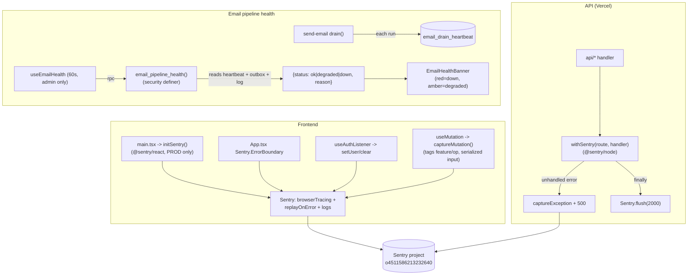

# Monitoring & Observability

**Purpose** — Error/crash visibility via Sentry (React frontend + Node serverless API) and a self-contained email-pipeline health monitor (per-drain heartbeat + a `SECURITY DEFINER` health RPC surfaced as an admin-only in-app banner). Edge Functions are intentionally **not** Sentry-instrumented.

## Data model

- **`email_drain_heartbeat`** — singleton (`id boolean primary key default true check (id)`) upserted by `send-email` on every drain run: `last_run_at`, `last_ok_at`, `processed`, `sent`, `failed`, `updated_at`. RLS: admins read; the function writes via service role (bypasses RLS).
- **`email_outbox`** / **`email_log`** — the health RPC reads these for stuck-pending, max-retry, and recent-failure counts (cols `status`, `attempts`, `created_at`).
- Sentry stores nothing in Postgres; both DSNs point at the same Sentry project `o4511586213232640` (region `de`). Frontend events carry the user via `Sentry.setUser({ id, email })`.

## Flow

## Functions / triggers / crons

- **`initSentry()`** (`src/lib/sentry.ts`) — `@sentry/react`, **PROD builds only** (dev returns early to spare quota). Integrations: `browserTracingIntegration` (`tracesSampleRate 0.2`), `replayIntegration` (`maskAllText`, `blockAllMedia`; `replaysSessionSampleRate 0`, `replaysOnErrorSampleRate 1.0`), `enableLogs`. `sendDefaultPii:false`. `ignoreErrors` drops realtime-reconnect noise (`Failed to fetch`, `phx_reply` timeouts, `CHANNEL_ERROR`). Called once from `main.tsx`.
- **`Sentry.ErrorBoundary`** (`App.tsx`) — wraps the app root with an `ErrorFallback`.
- **`captureMutation(feature, op, fn)`** (`src/lib/sentry/captureMutation.ts`) — wraps a React Query `mutationFn` so a thrown error is reported with `{feature, op}` tags + serialized (truncated/Map-Set-safe) input, then re-thrown so existing handling is unchanged. Used across feature mutation hooks (accounting, clients, offers, comments, tasks, …).
- **`Sentry.setUser`** (`useAuthListener.ts`) — tags events with `{id, email}` on sign-in, `null` on sign-out.
- **`withSentry(route, handler)`** (`api/_sentry.ts`) — `@sentry/node` wrapper for every Vercel API route: lazy `ensureInit` (`tracesSampleRate 0`, error-only), captures unhandled errors with `{route, method}` tags, returns `500`, and **`await Sentry.flush(2000)` in `finally`** (required on serverless before the instance freezes). `captureApiError(route, err)` for handlers that catch their own errors.
- **`email_pipeline_health()`** (`STABLE SECURITY DEFINER`) — admin-only (non-admins get bare `{status:'ok'}`). Computes: `last_run_age` from heartbeat, `stuck` (pending >15 min), `maxed` (pending `attempts>=5`), `failed_recent` (email_log failed in last hour), `oldest_pending`. Status = **`down`** if no heartbeat or `last_run_age > 600s`, **`degraded`** if any stuck/maxed/failed, else **`ok`**. Returns a jsonb `{status, reason, last_run_age_seconds, stuck_count, failed_count, oldest_pending_age_seconds}`.
- **`useEmailHealth(enabled)`** (`src/features/system_health/useEmailHealth.ts`) — React Query polling the RPC every 60s (`staleTime 30s`); **never throws** (a monitoring failure must not break the app). `EmailHealthBanner` renders red (`down`) / amber (`degraded`) for admins only, nothing when healthy.
- **Cron**: `recover_stale_email_claims` (`*/5 min`) is an independent safety net (see email-system doc) so a broken function can't strand rows in `sending` and silently degrade health.

## Gotchas

- **Edge Functions are NOT Sentry-instrumented** — only the React frontend and the Vercel Node API routes are. Re-deploying a Deno Edge Function carries `verify_jwt`/secret risk, so Edge observability relies on the email health monitor + Supabase `edge_logs`/`postgres_logs` instead.
- **The serverless `finally`-flush is load-bearing** — without `await Sentry.flush(2000)` the Vercel instance can freeze before the event is sent and the error is lost. Keep it in any new wrapped handler.
- **Both DSNs are public client DSNs** committed in source (frontend bundle + API). That's by design (a client DSN can only ingest, not read); override per-env with `VITE_SENTRY_DSN` / `SENTRY_DSN` if needed.
- **Sentry only reports from PROD frontend builds** — you won't see local/dev events in Sentry; verify error reporting against a production deploy.
- **Health `down` = drain not running for >10 min** (`last_run_age > 600`), which usually means the `*/2 min` cron or the `email_drain_secret`/`verify_jwt=false` wiring broke — check the drain cron + Vault secret before chasing app code.
- **The health RPC leaks nothing to non-admins** (`{status:'ok'}`), and the banner is admin-gated client-side too. Don't surface its detail fields to non-admin UI.
- **A stale Vercel build can masquerade as an outage** — after a deploy, old cached `index.html` 404s on old hashed chunks and interactions break until a hard refresh. Rule this out (check the deployed build) before triaging "X not working" as a backend/monitoring fault.

## File references

- `/Users/marios/Desktop/Cursor/itdevcrm/src/lib/sentry.ts`
- `/Users/marios/Desktop/Cursor/itdevcrm/src/lib/sentry/captureMutation.ts`
- `/Users/marios/Desktop/Cursor/itdevcrm/src/main.tsx`
- `/Users/marios/Desktop/Cursor/itdevcrm/src/App.tsx`
- `/Users/marios/Desktop/Cursor/itdevcrm/src/features/auth/hooks/useAuthListener.ts`
- `/Users/marios/Desktop/Cursor/itdevcrm/api/_sentry.ts`
- `/Users/marios/Desktop/Cursor/itdevcrm/supabase/migrations/20260615000003_email_health.sql`
- `/Users/marios/Desktop/Cursor/itdevcrm/src/features/system_health/useEmailHealth.ts`
- `/Users/marios/Desktop/Cursor/itdevcrm/src/features/system_health/emailHealth.ts`
- `/Users/marios/Desktop/Cursor/itdevcrm/src/features/system_health/EmailHealthBanner.tsx`
