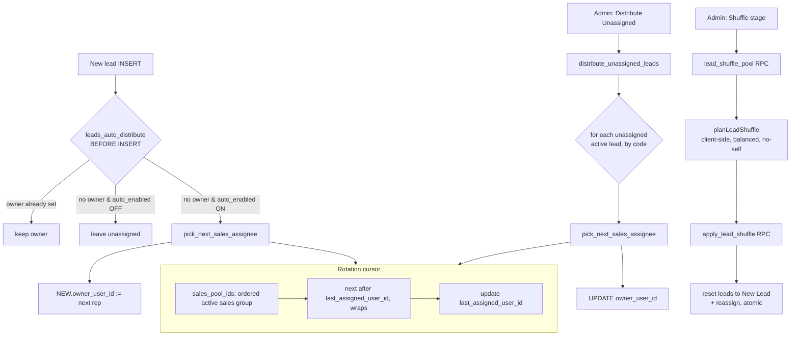

# Lead Distribution (Round-Robin)

**Purpose** — Assigns unassigned leads to sales reps in round-robin fashion across the sales group. Auto-assignment on insert is OFF by default; admins can also bulk-distribute existing unassigned leads or "shuffle" a whole stage. No lead is ever handed back to its current owner during a shuffle.

## Data model

### `lead_distribution_state` (singleton)
| Column | Notes |
| --- | --- |
| `id` boolean PK | always `true` (CHECK singleton) |
| `auto_enabled` boolean | round-robin on insert — **default `false`** |
| `auto_merge_enabled` boolean | intake auto-merge toggle (default `false`; see lead-intake doc) |
| `last_assigned_user_id` uuid → `profiles.user_id` | cursor for the rotation |
| `updated_at` timestamptz | |

RLS: readable by all authenticated; `auto_enabled`/state updatable by admins only.

### `profiles`
- `exclude_from_lead_distribution` boolean (default `false`) — pauses a rep from the rotation **without** touching their existing leads/access; reversible by setting it back.
- Pool membership = `is_active = true AND archived = false AND group.code = 'sales' AND exclude_from_lead_distribution = false`.

### `leads`
- `owner_user_id` — the assignee (the only column distribution touches).
- `estimated_total_value` generated column (one-time + monthly) backs board ordering.

## Flow

## Functions / triggers / crons

- **`sales_pool_ids()`** (SQL, security definer, stable) — the ordered rotation pool: active, non-archived `sales`-group members **excluding** `exclude_from_lead_distribution = true`, ordered by `full_name` then `user_id`. Single source of truth for the pool (auto-distribute, manual distribute, and shuffle all use it).
- **`pick_next_sales_assignee()`** (security definer) — returns the next rep after `last_assigned_user_id` (wraps with `(idx % len) + 1`; starts at pool[1] if the cursor is null or no longer in the pool), then advances `last_assigned_user_id`. Returns null on empty pool.
- **`leads_auto_distribute()`** — **BEFORE INSERT trigger** (`leads_auto_distribute_trg`) on `leads`. Only acts when the lead has no owner AND `auto_enabled` is true; sets `NEW.owner_user_id` from `pick_next_sales_assignee()`.
- **`distribute_unassigned_leads()`** (security definer, **admin-only**) — round-robins every active, non-converted, owner-null lead (ordered by `code`); returns the count assigned. Triggered by the "Distribute Unassigned" admin action.
- **`lead_shuffle_pool()`** (security definer, **admin-only**) — exposes `sales_pool_ids()` to the client-side shuffle planner.
- **`apply_lead_shuffle(p_stage_code, p_assignments jsonb)`** (security definer, **admin-only**, atomic) — applies a precomputed assignment: each lead is moved to **New Lead** and reassigned, but only if still in the chosen stage / not archived / not converted. Rejects a stage not in the shufflable set, and rejects any assignee that is null or no longer in `sales_pool_ids()` (one bad row aborts all). The `leads_activity` trigger logs each change, attributed to the calling admin. Shufflable stages: `new_lead`, `no_answer`, `working_on_it`, `offer_sent`, `scheduled`, `hot`.
- **`planLeadShuffle(leads, pool)`** (TypeScript, `src/features/sales/leadShuffle.ts`) — deterministic balanced round-robin that guarantees no lead returns to its current owner: clusters by owner, lays a balanced base, then repairs self-assignments by count-preserving swaps (falls back to least-loaded non-self rep). Throws `shuffle_needs_two_reps` if the pool has < 2 reps.

No crons.

## Gotchas

- **`auto_enabled` is OFF by default.** Auto-distribution on insert only runs when an admin turns it on. With it off, Meta/imported released leads land unassigned until manually distributed.
- The rotation cursor (`last_assigned_user_id`) is a single shared row; pausing/un-pausing a rep changes the pool mid-rotation and the cursor self-heals (if the last assignee left the pool, it restarts at pool[1]).
- Auto-distribute is a `BEFORE INSERT` trigger — it never reassigns an existing lead; only the manual RPCs do that.
- Shuffle resets the stage to **New Lead** and only ever reassigns leads still in the source stage (guards against drift between fetch and apply). The no-self rule is enforced both client-side (planner) and server-side (`apply_lead_shuffle` rejects out-of-pool assignees, but the no-self guarantee itself is from the planner).
- `exclude_from_lead_distribution` only stops **new** assignments; the rep keeps all existing leads. To rebalance their backlog you must shuffle/redistribute explicitly.

## File references

- `/Users/marios/Desktop/Cursor/itdevcrm/supabase/migrations/20260616124457_lead_distribution.sql` — state table, `sales_pool_ids`, `pick_next_sales_assignee`, `leads_auto_distribute` trigger, `distribute_unassigned_leads`
- `/Users/marios/Desktop/Cursor/itdevcrm/supabase/migrations/20260622130000_exclude_from_lead_distribution.sql` — `exclude_from_lead_distribution` + updated `sales_pool_ids`
- `/Users/marios/Desktop/Cursor/itdevcrm/supabase/migrations/20260623120000_lead_shuffle.sql` — `lead_shuffle_pool`, `apply_lead_shuffle`
- `/Users/marios/Desktop/Cursor/itdevcrm/src/features/sales/leadShuffle.ts` — `planLeadShuffle` planner
- `/Users/marios/Desktop/Cursor/itdevcrm/src/features/sales/SalesKanbanPage.tsx` — `SHUFFLABLE_CODES`, shuffle UI
- `/Users/marios/Desktop/Cursor/itdevcrm/src/features/sales/hooks/useShuffleStageLeads.ts` — shuffle mutation (fetch pool → plan → apply)
- `/Users/marios/Desktop/Cursor/itdevcrm/src/features/leads/hooks/useDistributeUnassigned.ts`, `useLeadDistribution.ts` — distribute action + toggle
