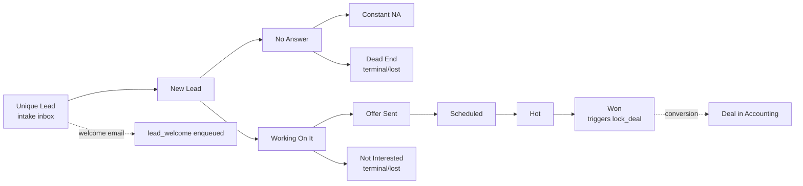
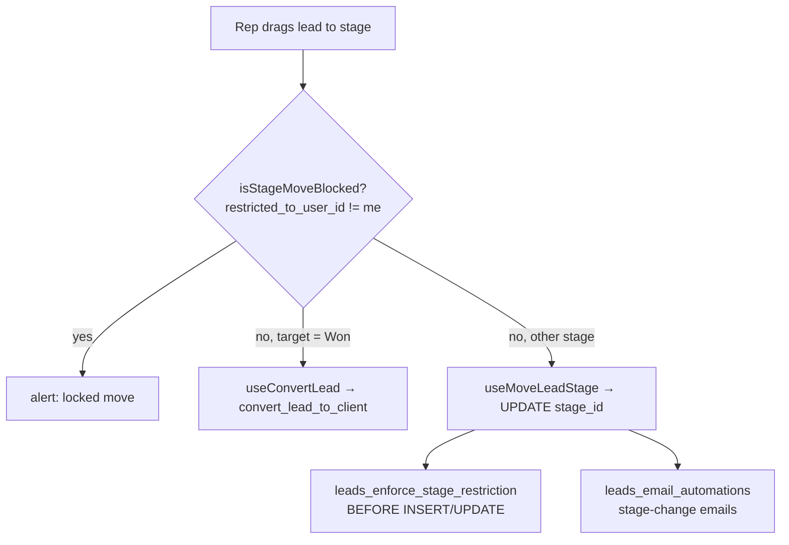

# Sales Kanban

**Purpose** — The sales pipeline board (`board = 'sales'`): 10 stages from "Unique Lead" (the intake inbox / first column) through to "Won". Reps drag their own leads between stages; certain stage entries are gated and a welcome email fires when a lead enters Unique Lead.

## Data model

### `pipeline_stages` (configurable columns)
| Column | Notes |
| --- | --- |
| `id` uuid PK | |
| `board` text | `sales` for this board |
| `code` text | stable code (unique per board) |
| `display_names` jsonb | `{en, el}` labels |
| `position` int | column order |
| `is_terminal` boolean, `terminal_outcome` text | `won`/`lost` for terminal sales stages |
| `triggers_action` text | `lock_deal` on the `won` stage |
| `restricted_to_user_id` uuid → `auth.users` | move-in lock (null = open) — set on `unique_lead` |

**Sales stages (by position):** `unique_lead` (pos 5, the first/intake column, restricted to mkifokeris), `new_lead` (10), `no_answer` (20), `constant_na` (30), `working_on_it` (40), `offer_sent` (50), `scheduled` (60), `hot` (70), `won` (80, terminal/`lock_deal`), `not_interested` (90, terminal/lost), `dead_end` (100, terminal/lost).

### `leads`
- `stage_id` → `pipeline_stages`, `owner_user_id` → `profiles`.
- `estimated_total_value` generated column (one-time + monthly) — backs `value_high`/`value_low` sort.
- `source` (`meta`/`manual`/`import`), `scheduled_for` (drives the scheduled-confirm email), `converted_at` (excludes converted leads from the board), `archived`.

### Cold / dead-end stage groups (used elsewhere)
- **dead-end**: `dead_end`, `not_interested` (`lead_dead_end_ids` / `lead_is_dead_end`).
- **cold** (re-engage candidates): `dead_end`, `not_interested`, `no_answer`, `constant_na` (`lead_cold_ids`).

## Flow

## Functions / triggers / crons

- **`leads_enforce_stage_restriction()`** — **BEFORE INSERT/UPDATE trigger** on `leads`. Blocks moving a lead INTO a `restricted_to_user_id` stage unless you are that user. Service role (`auth.uid()` null = Zapier webhook) and the GUC `app.intake_release='on'` (release/re-engage path) bypass it. No admin bypass. Fires only when the stage changes. This is what keeps **Unique Lead** locked against manual drag by everyone except mkifokeris.
- **`leads_set_default_stage()`** — BEFORE INSERT: if `stage_id` is null, routes `source='meta'` leads to `unique_lead`, everything else to `new_lead`. (In practice all incoming leads go through intake → Release, which sets `unique_lead` directly.)
- **`leads_email_automations()`** — trigger on `leads`. On entering **`unique_lead`** enqueues `lead_welcome` (idempotent via dedupe key); on `scheduled_for` change enqueues `scheduled_confirm`; on entering `won` enqueues `won_welcome` + `won_next_steps`; starts/stops stage-bound email sequences (`lead_sequence_runs`) on stage change.
- **`sales_kanban_counts(p_owner, p_source, p_search)`** (SQL, **security invoker** → RLS applies) — per-stage `count(*)` for the board headers (true totals without loading rows); reps count only their own, admins count all. Backed by partial indexes on `(stage_id, created_at/updated_at/estimated_total_value)`.
- **`isStageMoveBlocked(stage, userId)`** (TS, `stageAccess.ts`) — client mirror of the restriction (returns true if `restricted_to_user_id` is set and ≠ current user); blocks the drag and shows a locked-move alert before hitting the server.

No crons specific to the board (email delivery runs on its own drain cron).

## Visibility

- **Reps see their own leads only.** RLS `leads_select`: `current_user_is_admin() OR current_user_can('sales','view_all') OR owner_user_id = auth.uid()`.
- **Sales manager (`tvogiatzi@itdev.gr`) + admins see all** via the per-user `sales/view_all` capability (granted in `user_permissions`).
- The kanban page also enforces own-only in the UI: non-admins default the board filter to `{ ownerId: userId }` (RLS is the real boundary; the UI filter is belt-and-braces). Columns are independently paginated ("Load more") with up-front totals from `sales_kanban_counts`.

## Gotchas

- **Unique Lead is the first column** (`position 5`, before `new_lead` at 10) and is **move-in restricted to mkifokeris** via `restricted_to_user_id`. The only ways a lead enters it are: the intake Release/Re-engage path (GUC bypass), the service-role webhook, or mkifokeris dragging manually. Other admins are blocked — there is no admin bypass on this trigger.
- The **welcome email fires on ENTRY to Unique Lead**, not on lead insert (retimed in `20260615000008`). A lead created directly in another stage gets no welcome until it reaches Unique Lead.
- `sales_kanban_counts` is **security invoker** on purpose — it must reflect each caller's RLS scope (own vs all). Do not change it to security definer or reps would see global counts.
- Dragging to **Won** does not just move the stage — it runs `convert_lead_to_client` (full conversion). See conversion doc.
- Terminal stages (`won`/`not_interested`/`dead_end`) are display-terminal; `not_interested`/`dead_end` feed the cold/dead-end groups used by intake re-engage/merge.

## File references

- `/Users/marios/Desktop/Cursor/itdevcrm/supabase/migrations/20260502000002_pipeline_stages.sql` — table + seeded sales stages
- `/Users/marios/Desktop/Cursor/itdevcrm/supabase/migrations/20260615000008_unique_lead_stage.sql` — Unique Lead column, `restricted_to_user_id`, restriction trigger, welcome-on-entry
- `/Users/marios/Desktop/Cursor/itdevcrm/supabase/migrations/20260618000004_sales_kanban_counts.sql` — `sales_kanban_counts`, `estimated_total_value`, ordering indexes
- `/Users/marios/Desktop/Cursor/itdevcrm/supabase/migrations/20260618000001_leads_own_only_for_sales.sql` — reps own-only RLS
- `/Users/marios/Desktop/Cursor/itdevcrm/supabase/migrations/20260618000009_leads_view_all_manager.sql` — `sales/view_all` for the manager
- `/Users/marios/Desktop/Cursor/itdevcrm/supabase/migrations/20260502000017_leads_table.sql` — `leads` table + RLS policies
- `/Users/marios/Desktop/Cursor/itdevcrm/src/features/sales/SalesKanbanPage.tsx` — board page (drag, filter, shuffle)
- `/Users/marios/Desktop/Cursor/itdevcrm/src/features/sales/stageAccess.ts` — `isStageMoveBlocked`
- `/Users/marios/Desktop/Cursor/itdevcrm/src/features/sales/hooks/useSalesKanbanCounts.ts` — counts hook
- `/Users/marios/Desktop/Cursor/itdevcrm/src/features/leads/hooks/useMoveLeadStage.ts` — stage-move mutation

## Sales emails from the owner's Gmail (2026-08-25)

Automated lead emails (welcome, no-answer/offer sequences, scheduling,
re-engage — NOT the won emails) send **from the lead owner's personal Gmail
with CC sales@itdev.gr**, carrying the owner's personal signature and
display-name From. Mechanics: `enqueue_lead_email` stamps
`email_outbox.send_as_user_id = owner`; the send-email drain tries the
owner-Gmail transport (`trySendTemplateViaOwnerGmail`) and on ANY obstacle
(no/revoked Google connection, token refresh failure, Gmail rejection) falls
back to the unchanged Resend path (from sales@, CC owner) — no email is ever
lost. Gmail sends log as identity `personal` with the real template_key and
show green ("sent") in the lead Emails box — Gmail provides no
delivered/bounced signal; bounces arrive in the owner's inbox. Each rep must
connect their own Gmail (Profile → Connect Google).
