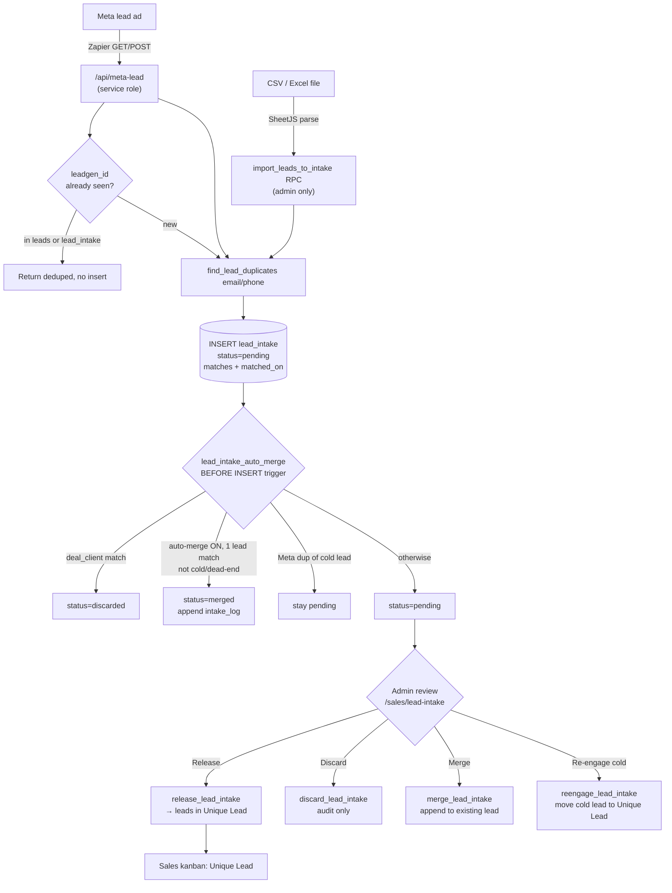

# Lead Intake

**Purpose** — Every incoming lead (Meta lead-ad webhook + CSV/Excel import) lands in a `lead_intake` holding queue instead of going straight to the sales board; an admin reviews each row and Releases, Discards, Merges, or Re-engages it. Possible duplicates against existing leads and deal-customers are flagged up-front so nothing reaches the pipeline unvetted.

## Data model

### `lead_intake` (the holding queue — admin-readable only)
| Column | Notes |
| --- | --- |
| `id` uuid PK | |
| `status` text | `pending` \| `released` \| `discarded` \| `merged` (default `pending`; CHECK originally `pending/released/discarded`, `merged` added by the merge-schema migration) |
| `source` text | `meta` \| `import` (default `meta`) |
| `source_data` jsonb | full raw webhook/import payload (Meta `leadgen_id` lives here at `source_data->>'leadgen_id'`) |
| `title` text | card title (form name, or company/name for imports) |
| `contact_first_name`, `contact_last_name`, `email`, `phone`, `website`, `company_name` | resolved contact fields |
| `phone_normalized` text | **plain** column (NOT generated) — last 10 digits, set by the webhook/import |
| `contact_info` text | assembled notes (campaign context, form answers) |
| `matched_on` text[] | distinct matched fields, e.g. `{email}`, `{phone}` |
| `matches` jsonb | array of duplicate-match objects (`match_type`, `record_id`, `display_name`, `context`, `matched_field`) |
| `reviewed_by` uuid → `auth.users`, `reviewed_at` timestamptz | who actioned the row and when |
| `released_lead_id` uuid → `leads` | the lead created on Release (or re-engaged target) |
| `merged_into_lead_id` uuid → `leads` | merge target (added by `20260621120000`) |

Indexes: `lead_intake_pending_idx` (partial, `status='pending'`), `lead_intake_leadgen_idx` (`source_data->>'leadgen_id'`).

### `leads` (the pipeline target — created on Release)
Key columns relevant to intake: `source` (`meta`/`manual`/`import`), `source_data` jsonb, `stage_id` → `pipeline_stages`, `owner_user_id`, `phone_normalized` (**generated** column: `right(regexp_replace(phone,'[^0-9]','','g'),10)`), `intake_log` text (merge/re-engage append log), `archived`, `converted_at`.

> **`phone_normalized` differs between the two tables**: generated/stored on `leads` (auto-recomputes from `phone`); plain text on `lead_intake` (the writer must compute it).

## Flow

## Functions / triggers / crons

- **`/api/meta-lead.ts`** (Vercel serverless, service role) — public Meta lead-ad endpoint. Accepts GET (query params) or POST (JSON). Auth via shared secret `META_LEAD_SECRET` (header `x-meta-secret` or `key` param, constant-time-ish length+equality check; `key` is stripped before persisting). Resolves fields by exact name then fuzzy regex (handles Greek Meta form labels); also handles the positional `COL$A..COL$S` "Meta → Excel → Zapier" columnar format via `parseColumnarMetaLead`. Dedups on `leadgen_id` (checks both `leads` and `lead_intake`); on new leads, calls `find_lead_duplicates`, then INSERTs into `lead_intake`.
- **`find_lead_duplicates(p_email, p_phone)`** (SQL, security definer, stable) — returns every existing `lead` and `deal_client` (a `clients` row that has ≥1 deal) matching the email (case-insensitive) or normalized phone (last 10 digits). Returns `match_type`, `record_id`, `display_name`, `context` (lead's stage / client's deal codes), `matched_field`.
- **`import_leads_to_intake(p_rows jsonb)`** (security definer, **admin-only**) — bulk-inserts CSV/Excel rows (parsed client-side by `parseLeadFile`/`mapRowsToLeads`) into `lead_intake` as `source='import'`; runs the same `find_lead_duplicates` check per row; returns `{imported, flagged}`.
- **`release_lead_intake(p_id, p_force default false)`** (security definer, **admin-only**) — re-evaluates duplicates NOW (excluding self), refreshes `matches`/`matched_on`; if duplicates exist and `p_force=false` returns `has_duplicates` + `duplicate_count` (UI confirms, retries with `p_force=true`); otherwise sets GUC `app.intake_release='on'`, INSERTs into `leads` with `stage_id = unique_lead`, marks the row `released`.
- **`discard_lead_intake(p_id)`** (security definer, **admin-only**) — marks the row `discarded` (audit only; never reaches `leads`).
- **`merge_lead_intake(p_id, p_target_lead_id)`** (security definer, **admin-only**) — appends `format_intake_merge_block(r)` onto `leads.intake_log` of an existing **lead match** (never overwrites fields); marks the row `merged`. Target must be in this row's `matches` as `match_type='lead'`.
- **`reengage_lead_intake(p_id, p_target_lead_id)`** (security definer) — for a Meta dup matching a **cold** lead (`dead_end`/`not_interested`/`no_answer`/`constant_na` via `lead_cold_ids`): moves that lead to Unique Lead, appends to `intake_log`, marks the row `released` (`released_lead_id` = the re-engaged lead). Resends welcome only if one was already sent.
- **`lead_intake_auto_merge()`** — **BEFORE INSERT trigger** on `lead_intake`. Auto-discards rows matching a deal-customer; if `lead_distribution_state.auto_merge_enabled` is on and there is exactly one lead match (not cold, not dead-end), auto-merges; Meta dups of cold leads are left `pending` for manual re-engage.

No crons. All queue writes are service-role (webhook) or security-definer RPCs; RLS exposes SELECT to admins only.

## Gotchas

- `lead_intake.phone_normalized` is a **plain** column — the webhook (`phoneDigits.slice(-10)`) and `import_leads_to_intake` must set it explicitly; on `leads` it is generated. Backfilled once for stranded phones (`20260622160000`).
- The webhook **always** inserts into `lead_intake` now (even clean leads) — the "duplicate check" only sets `matches`/`matched_on`; clean leads simply have empty `matches`.
- Meta-form phone placeholders (`0000000000`) and emails stranded under Greek keys (e.g. `Διεύθυνση email`) defeat dedup; the import parser maps these Greek aliases, and the webhook fuzzy-resolves them.
- Release re-runs dedup at release time (defense-in-depth) — a row clean at intake can still be blocked at Release if a matching lead/customer appeared meanwhile.
- `leadgen_id` dedup is the only hard idempotency for Meta; retries return the existing `leads`/`lead_intake` id without inserting.

## File references

- `/Users/marios/Desktop/Cursor/itdevcrm/supabase/migrations/20260619160000_lead_intake.sql` — table, `find_lead_duplicates`, original release/discard, RLS
- `/Users/marios/Desktop/Cursor/itdevcrm/supabase/migrations/20260619190000_lead_import_and_release_unique.sql` — `import_leads_to_intake`, release → Unique Lead
- `/Users/marios/Desktop/Cursor/itdevcrm/supabase/migrations/20260622200000_release_lead_intake_recheck.sql` — `release_lead_intake(uuid, boolean)` re-check
- `/Users/marios/Desktop/Cursor/itdevcrm/supabase/migrations/20260621120000_lead_intake_merge_schema.sql` — `merged`/`intake_log`/`merged_into_lead_id`/`auto_merge_enabled`
- `/Users/marios/Desktop/Cursor/itdevcrm/supabase/migrations/20260621120200_merge_lead_intake.sql` — `merge_lead_intake`
- `/Users/marios/Desktop/Cursor/itdevcrm/supabase/migrations/20260621120300_lead_intake_auto_merge.sql` — auto-merge trigger
- `/Users/marios/Desktop/Cursor/itdevcrm/supabase/migrations/20260623130000_reengage_cold_lead_intake.sql` — `reengage_lead_intake`, `lead_cold_ids`
- `/Users/marios/Desktop/Cursor/itdevcrm/supabase/migrations/20260622200100_lead_dead_end_ids.sql` — `lead_dead_end_ids`
- `/Users/marios/Desktop/Cursor/itdevcrm/supabase/migrations/20260614000001_pbx_phone_lookup.sql` — `leads.phone_normalized` generated column
- `/Users/marios/Desktop/Cursor/itdevcrm/api/meta-lead.ts` — Meta webhook
- `/Users/marios/Desktop/Cursor/itdevcrm/src/features/leads/leadImport.ts` — CSV/Excel parser + Greek aliases
- `/Users/marios/Desktop/Cursor/itdevcrm/src/features/leads/LeadIntakePage.tsx` — review UI (Release/Discard/Merge/Re-engage, bulk + auto-merge toggle)
- `/Users/marios/Desktop/Cursor/itdevcrm/src/features/leads/intakeMatches.ts` — match filtering helpers
