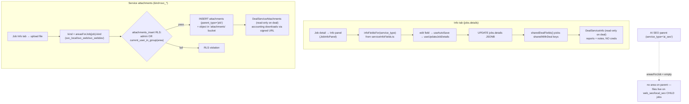

# Service Info Tab & Service Attachments

**Purpose** — Per-service operational data on each job: structured Info fields (URLs / credentials / notes) stored in `jobs.details` (JSONB), and per-service file uploads stored as `attachments` rows with `kind='svc_*'`, group-gated by RLS. A curated subset of both surfaces read-only on the parent deal for accounting.

## Data model

### Info tab — `jobs.details jsonb`
- **`public.jobs.details jsonb not null default '{}'`** (`20260615000005_job_details.sql`) — a free-form bag of per-service fields. The same migration emptied the monthly checklist templates for `local_seo`/`web_seo`/`ai_seo` (the Info tab replaced them).
- Field schema is **frontend-defined**, not enforced in SQL, in `src/features/jobs/serviceInfoFields.ts` (`SERVICE_INFO_FIELDS`):
  - `local_seo`: `profile_url` (url), `business_profile` (text), `local_report_url` (url, shared), `local_notes` (textarea, shared).
  - `web_seo`: `website_username` (text), `website_password` (**password**), `website_path` (text), `web_report_url` (url, shared), `seo_notes` (textarea, shared).
  - `web_dev`: `webdev_notes` (shared), `hosting`, `supabase_name`, `temp_url` (url), `live_url` (url), `email`.
  - `ads`: `ads_notes` (textarea, shared).
  - `ai_seo`: the **union** of LOCAL (`section='Local SEO'`) + WEB_SEO (`section='Web SEO'`) fields.
- `sharedWithDeal: true` marks the fields that bubble up to the deal Overview (reports + notes — never credentials).

### Service attachments — `public.attachments` (`kind='svc_*'`)
- **`public.attachments`** (`20260502000009_collaboration.sql`): `parent_type` (`'client'|'deal'|'job'`), `parent_id`, `storage_path`, `file_name`, `file_size`, `mime_type`, `uploaded_by`, **`kind text default 'other'`**, archive cols. Files live in the `attachments` storage bucket.
- Service kinds: **`svc_local`** (→ `local_seo` group), **`svc_web`** (→ `web_seo`), **`svc_webdev`** (→ `web_dev`). Mapping in `src/features/attachments/serviceAreas.ts` (`AreaKind` / `ServiceArea`).
- Service attachments attach to a **job** (`parent_type='job'`).

## Flow

## Functions / triggers / crons

- **`useUpdateJobDetails(jobId)`** (`src/features/jobs/hooks/useUpdateJobDetails.ts`) — patches `jobs.details`; driven by `useAutoSave` debounce in `JobInfoPanel.tsx`. Password fields render masked with a reveal toggle.
- **`sharedDealFields(serviceType, details)`** (`serviceInfoFields.ts`) — returns only `sharedWithDeal` fields with non-empty values; consumed by `DealServiceInfo.tsx` to render reports/notes read-only on the deal.
- **`current_user_in_group(p_code text)`** (`20260624140000_service_attachment_rls.sql`) — SECURITY DEFINER helper: is the current user in group `p_code` (`local_seo`/`web_seo`/`web_dev`)?
- **RLS `attachments_insert`** (`20260624140000`) — allows insert when `auth.uid() = uploaded_by` AND (kind is null/non-svc, OR admin, OR `svc_local`+local_seo group / `svc_web`+web_seo / `svc_webdev`+web_dev). Non-service kinds (contract/invoice/other) keep prior open behaviour.
- **RLS `attachments_delete`** (`20260624140000`) — admin OR uploader OR the owning group of a `svc_*` file.
- **Storage RLS `attachments_delete_own` on `storage.objects`** (`20260624160000_attachments_storage_delete_fix.sql`) — broadened from owner-only to owner OR admin OR owning-group of the matching `svc_*` `attachments` row (`parent_type='job'`), mirroring the table delete rule. Fixed orphaned storage files when admins/teammates deleted a row but couldn't delete the file.
- **`areasForJob(job)`** (`serviceAreas.ts`) — `local_seo→[svc_local]`, `web_seo→[svc_web]`, `web_dev→[svc_webdev]`, **everything else (incl. `ai_seo`) → `[]`**.
- **`DealServiceAttachments.tsx`** — read-only deal view: groups files by `SERVICE_AREA_KINDS`, downloads via `supabase.storage.createSignedUrl(path, 300)`.

## Gotchas

- **Credentials never bubble to the deal.** Only `sharedWithDeal` fields (reports + notes) appear in `DealServiceInfo`; `website_password`, usernames, paths, profile URLs stay job-only. The deal Overview is accounting-facing.
- **`details` schema is frontend-only.** SQL stores a free JSONB bag; adding/renaming a field is a `serviceInfoFields.ts` change, no migration. Old keys in `details` simply stop rendering.
- **AI SEO files live on the children, not the parent.** `areasForJob` returns `[]` for the `ai_seo` parent (service teams can't even view it via jobs RLS). Local/Web files attach to the `local_seo` / `web_seo` **child** jobs, which match `areasForJob` by `service_type`, so the Local/Web teams open them from their own boards.
- **Group gating is by `kind`, not by the job's board.** A `web_dev` member can only write `svc_webdev`; uploading a `svc_local` file requires `local_seo` group membership (or admin). Mismatched `kind`/group → RLS violation on insert.
- **Storage key sanitisation** — Greek-named files (invoices, reports) failed to upload because Supabase Storage rejects non-ASCII object keys; the upload hook builds the storage key via a `sanitizeStorageFileName` util. (Memory: `reference_storage_key_sanitize`.) Always wrap any storage key that interpolates `file.name`.
- **Deleting a row used to orphan the file** — fixed by `20260624160000`; both the `attachments` row delete and the `storage.objects` delete must succeed, and the delete hook now surfaces the storage error.

## File references

- `supabase/migrations/20260615000005_job_details.sql` — `jobs.details` column + emptied SEO checklist templates.
- `supabase/migrations/20260502000009_collaboration.sql` — `attachments` table + base RLS.
- `supabase/migrations/20260624140000_service_attachment_rls.sql` — `current_user_in_group` + `svc_*` insert/delete RLS.
- `supabase/migrations/20260624160000_attachments_storage_delete_fix.sql` — storage.objects delete RLS.
- `src/features/jobs/serviceInfoFields.ts` — `SERVICE_INFO_FIELDS`, `infoFieldsFor`, `sharedDealFields`.
- `src/features/jobs/JobInfoPanel.tsx` — Info-tab editor (autosave, password reveal).
- `src/features/attachments/serviceAreas.ts` — `svc_*` kinds, `areaForKind`, `areasForJob`, `canUploadArea`.
- `src/features/deals/DealServiceInfo.tsx` — read-only shared Info on the deal.
- `src/features/deals/DealServiceAttachments.tsx` — read-only service files on the deal (signed-URL download).
