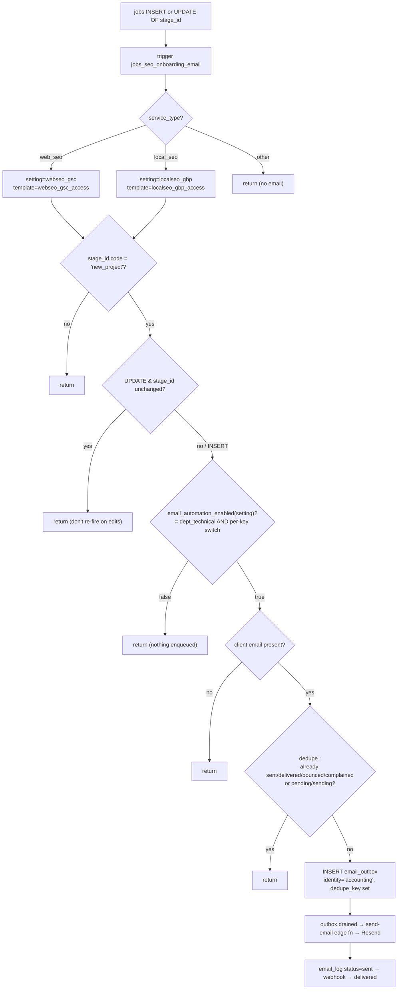

# SEO Onboarding Emails (GSC / GBP Access)

**Purpose** — When a `web_seo` or `local_seo` job lands in its board's `new_project` column, an access-request email is auto-enqueued to the client: `webseo_gsc_access` (Google Search Console) for web SEO, `localseo_gbp_access` (Google Business Profile) for local SEO. Covers genuine new work (including AI SEO children) without double-sending, and is gated by the Technical department + per-key toggles.

## Data model

- **`public.email_templates`** — `key` (`'webseo_gsc_access'`, `'localseo_gbp_access'`), `subject`, `body` (markdown-lite since 2026-08-31: `**bold**`, `## heading`, `- bullets`, blank-line paragraphs; URLs and e-mails auto-linked — rendered by `supabase/functions/_shared/emailMarkup.ts`, the same module the admin preview uses; offer composer `offer_*`/`ud_offer_*` rows are the exception, still plain text via `textToHtml`), `client_facing=true`. Seeded in `20260624080000_seo_onboarding_emails.sql`; editable later in the email-templates admin UI (DB row is authoritative).
- **`public.email_automation_settings`** — `key`, `enabled`. Relevant keys: per-automation `webseo_gsc` / `localseo_gbp`; department masters `dept_technical` (+ `dept_sales`, `dept_accounting`); legacy master `global`.
- **`public.email_outbox`** (`20260602000001_email_tables.sql`) — `identity` (`'sales'|'accounting'|'internal'`), `to_email`, `template_key`, `data jsonb`, `dedupe_key`, `status` (`'pending'|'sent'|'failed'`; `'sending'` used transiently). The trigger inserts here with `identity='accounting'`.
- **`public.email_log`** — audit + idempotency; `status` becomes `'sent'`, then the Resend delivery webhook advances it to `'delivered'`/`'bounced'`/`'complained'`.
- **`public.jobs`** — `service_type`, `stage_id`, `client_id`, `deal_id` drive the trigger; **`public.clients.email`** is the recipient.

Dedupe key format: **`<setting_key>:<deal_id>`** (e.g. `webseo_gsc:<uuid>`) — one onboarding email per deal per service type.

## Flow

## Functions / triggers / crons

- **`jobs_seo_onboarding_email()` / trigger `jobs_seo_onboarding_email`** — current definition `20260626000003_seo_onboarding_dedupe_delivered.sql`. SECURITY DEFINER. Fires `AFTER INSERT OR UPDATE OF stage_id ON public.jobs`. Logic:
  1. Map `service_type` → `(setting_key, template_key)`; non-SEO → return.
  2. Look up `pipeline_stages.code` for `new.stage_id`; **only proceed if it is `'new_project'`** (`20260626000002`).
  3. On `UPDATE`, only proceed if `stage_id` actually changed (just moved **into** `new_project`).
  4. Gate on `email_automation_enabled(setting_key)`.
  5. Read `clients.email`; skip if blank.
  6. Dedupe on `<setting_key>:<deal_id>` — skip if an `email_log` row exists with status in **`('sent','delivered','bounced','complained')`** OR an `email_outbox` row is `('pending','sending')`.
  7. `INSERT INTO email_outbox (identity='accounting', to_email, template_key, '{}', dedupe_key)`.
- **`email_automation_enabled(setting_key)`** (`20260624110000_email_department_toggles.sql`) — SECURITY DEFINER. For client keys, returns `dept_<department>` master AND the per-key switch; `email_setting_department('webseo_gsc')='technical'`, `('localseo_gbp')='technical'`. So an SEO onboarding email fires **iff** `dept_technical=true` AND (`webseo_gsc`|`localseo_gbp`)`=true`. Internal/unmapped keys fall back to the `global` master.
- **`seo_access_sent_map()`** (`20260626110000_seo_access_sent_map.sql`) — SECURITY DEFINER, `authenticated`-granted (email_log is admin-read). Returns `(template_key, lower(to_email), last_sent)` for the two access templates where `status='sent'`. Powers the on-card "Request access" button's sent-state checkmark.
- **Manual send** — `RequestSeoAccessButton.tsx` (`useRequestSeoAccess`) lets a user re-send the access email on demand from the job card; sent state derived from `seo_access_sent_map`.
- **Outbox drain** — a cron-driven drainer reads `email_outbox` pending rows and calls the `send-email` edge function (`supabase/functions/send-email`), which renders the template, linkifies URLs, routes the `accounting` identity, and writes `email_log`. Delivery status is updated by the `resend-webhook` edge function.

## Gotchas

- **Tied to `new_project`, not "any insert".** The original `20260624080000` fired on every SEO job INSERT, which spammed onboarding emails as the existing client book + AI SEO split placed jobs across many working stages. `20260626000002` re-scoped it to **landing in `new_project`** (insert into, or move into). Routing a renewed job to `renewal` (not `new_project`) deliberately suppresses the email — see the `20260626000016/17` renewal backfills.
- **Dedupe must count delivered, not just sent.** `20260626000003` fixed a bug where the Resend webhook advanced `email_log.status` `sent → delivered`, making an already-delivered email look un-sent and re-send when the trigger re-fired on a move-into-`new_project`. The check now includes `delivered/bounced/complained`.
- **Closed while department off.** With `dept_technical=false` (default OFF until an admin activates Technical), the trigger enqueues **nothing**. Re-opening = flip `dept_technical` AND the per-key switch to `true`. (`webseo_gsc`/`localseo_gbp` themselves default `enabled=true`.)
- **AI SEO children each trigger their own email** — the web child (GSC) and local child (GBP), each deduped by `<setting>:<deal_id>`, so the same deal never double-sends within a service type.
- **Recipient is `clients.email`** (not a contact row); a blank client email silently skips. The two templates hard-code grant targets (`info@itdev.gr` for GSC, `itdevgr24@gmail.com` for GBP) and the responsible person's contact.
- **`identity='accounting'`** — these go out from the accounting identity, so the send-email function applies the accounting from/CC routing.

## File references

- `supabase/migrations/20260624080000_seo_onboarding_emails.sql` — templates + `webseo_gsc`/`localseo_gbp` settings + original trigger.
- `supabase/migrations/20260626000002_seo_onboarding_on_new_project_stage.sql` — re-scope to `new_project` (insert/move-in).
- `supabase/migrations/20260626000003_seo_onboarding_dedupe_delivered.sql` — dedupe counts delivered/bounced/complained.
- `supabase/migrations/20260624110000_email_department_toggles.sql` — `email_automation_enabled`, `email_setting_department`, `dept_*` toggles.
- `supabase/migrations/20260626110000_seo_access_sent_map.sql` — `seo_access_sent_map` for the on-card button.
- `supabase/migrations/20260602000001_email_tables.sql` — `email_outbox` / `email_log` schema.
- `supabase/functions/send-email/` — outbox processor → Resend; `supabase/functions/resend-webhook/` — delivery status.
- `src/features/jobs/RequestSeoAccessButton.tsx`, `seoAccessButton.ts`, `hooks/useSeoAccessSentMap.ts`, `hooks/useRequestSeoAccess.ts` — manual request UI.
