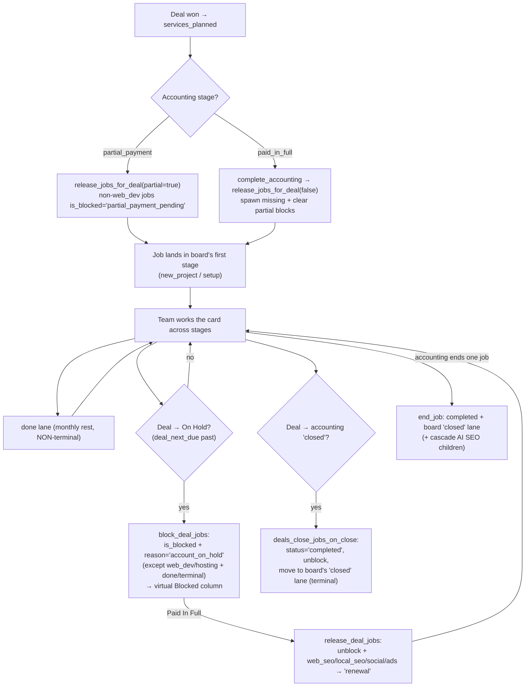

# Service Boards & Job Lifecycle

**Purpose** — Defines the six per-service kanban boards (`web_seo`, `local_seo`, `web_dev`, `hosting`, `social_media`, `ads`) and the job lifecycle that moves a `jobs` row across them from "won service" to "closed", including the virtual Blocked column, the non-terminal `done` monthly-rest lane, the `renewal` lane, and the terminal `closed` lane.

## Data model

**`public.pipeline_stages`** (`supabase/migrations/20260502000002_pipeline_stages.sql`) — one row per kanban column. Key columns:
- `board text` — `'web_seo' | 'local_seo' | 'web_dev' | 'hosting' | 'social_media' | 'ads'` (also `'sales'`, `'accounting_onboarding'`).
- `code text` — stage code, unique per `(board, code)`.
- `display_names jsonb` — `{"en": …, "el": …}`.
- `position int` — column order.
- `is_terminal boolean` + `terminal_outcome text` (`'completed'` etc.).
- `archived boolean` — archived stages drop off the board but keep FK integrity + history.

**`public.jobs`** (`supabase/migrations/20260502000008_deals_jobs.sql` + later) — one row per won service of a deal. Key columns:
- `deal_id`, `client_id` — FK (both `on delete cascade`).
- `service_type text` — CHECK now `('web_seo','local_seo','web_dev','social_media','ai_seo','hosting','ads')` (widened in `20260511000001_ads_service_support.sql`).
- `stage_id uuid` — current column on its board (nullable; the `ai_seo` billing parent is NULL — off-board).
- `code text` — unique per-job code `<dealcode>-<SERVICE>[-N]` (see `20260618130000_job_unique_codes.sql`).
- `owner_user_id`, `assigned_group_id`.
- `status text` — `'active' | 'paused' | 'cancelled' | 'completed'`.
- `is_blocked boolean`, `blocked_reason text`, `blocked_at`, `blocked_by` (`20260504000001_jobs_blocked_state.sql`) — the **virtual block**; `stage_id` is untouched while blocked.
- Billing cols (`20260617000005_jobs_billing_columns.sql`): `amount_net`, `vat_rate`, `billing_active`, `billing_only`, `is_custom`, `title`, `description`.
- `parent_job_id uuid` — AI SEO child→parent link (see `ai-seo.md`).
- `details jsonb` — per-service Info tab (see `info-attachments.md`).

### Per-board stages (current)

| Board | Working stages | `renewal`? | non-terminal `done`? | Terminal lanes |
|-------|----------------|:---:|:---:|----------------|
| `web_seo` | new_project, no_response, gsc_ga4_setup, sitemap_schema, performance_audit, technical_crawl, keyword_research, metadata, content, internal_links, backlink_cleanup, blogs, results_review, stuck | ✅ | ✅ | `closed` |
| `local_seo` | new_project, called_no_response, send_form, optimize, rank_tracking, new_gbp, suspended, verification | ✅ | ✅ | `closed` |
| `ads` | onboarding, audit_strategy, active, on_hold | ✅ | ✅ | `cancelled`, `closed` |
| `social_media` | onboarding, content_plan ("Working"), active, on_hold | ✅ | ✅ (sits before `closed`) | `cancelled`, `closed` |
| `web_dev` | new_project, client_contact, no_response, get_requirements, planning, development, stuck, revision, redesign, waiting_client_approval | — | — | `live` (terminal), `closed` |
| `hosting` | setup, active | — | — | `closed` |

Sources: `20260615000002_web_seo_kanban_clickup_stages.sql`, `20260610000002_local_seo_stages.sql`, `20260615000001_web_dev_kanban_clickup_stages.sql`, `20260502000023_add_ai_seo_hosting_groups.sql`, `20260511000001_ads_service_support.sql`, `20260618000006_deal_close_jobs.sql`, `20260618000010/11_*_closed_lane.sql`, `20260626000014_ads_social_renewal_stage.sql`, `20260626000018_done_nonterminal_and_lanes.sql`.

> `done` was originally seeded terminal on web_seo/local_seo; `20260626000018` flipped it **non-terminal** ("monthly rest") and added a `done` lane to `ads` + `social_media`.
> "Blocked" is **not** a stage — it is a virtual column rendered from `jobs.is_blocked` on `local_seo`, `web_seo`, `social_media`, `ads` only (`BLOCKED_COLUMN_BOARDS` in `kanbanGrouping.ts`). `web_dev` + `hosting` jobs are never blocked.

## Flow

## Functions / triggers / crons

- **`release_jobs_for_deal(target_deal_id uuid, partial_payment_mode boolean)`** — SECURITY DEFINER. Iterates `deals.services_planned`; idempotently spawns one job per `(deal, service_type)` in the board's first non-archived stage. When `partial_payment_mode`, non-`web_dev` jobs start blocked with `blocked_reason='partial_payment_pending'`. AI SEO emits a 3-row trio (see `ai-seo.md`). Latest body: `20260624050000_release_jobs_ai_seo_trio.sql`.
- **`deals_release_jobs_on_partial_payment()` / trigger `deals_release_jobs_partial_payment`** — AFTER UPDATE on `deals` when `accounting_stage_id` changes to `partial_payment`; calls `release_jobs_for_deal(id, true)`.
- **`complete_accounting(target_deal_id)`** — on Paid In Full: spawns any missing jobs unblocked and clears `partial_payment_pending` blocks (`20260504000001`).
- **`block_job(job_id, reason)` / `unblock_job(job_id)`** — SECURITY DEFINER manual block RPCs; gated on admin OR `accounting_onboarding:edit` (`20260504000001`).
- **`block_deal_jobs(deal_id)`** — blocks every open job of a deal **except `web_dev`/`hosting`** and except jobs in a terminal or `done` stage, with `blocked_reason='account_on_hold'` (`20260626000010`, refined `20260626000019_block_excludes_done.sql`). Idempotent. AI SEO parent + children blocked as one unit.
- **`release_deal_jobs(deal_id)`** — unblocks `account_on_hold` jobs and routes `web_seo/local_seo/social_media/ads` → `'renewal'` (`20260626000014`).
- **`deals_hold_jobs_on_stage_change()` / trigger `deals_hold_jobs_on_hold`** — AFTER UPDATE on `deals.accounting_stage_id`: `on_hold` → `block_deal_jobs`; `paid_in_full` → `release_deal_jobs`; leaving a blocked stage clears `account_on_hold` holds (`20260626000010`).
- **`deals_close_jobs_on_close()` / trigger `deals_close_jobs_on_close`** — AFTER UPDATE of `accounting_stage_id`: on `'closed'`, sets every non-archived non-terminal job `status='completed'`, unblocks, and moves it to its board's `'closed'` lane (`20260626000021_close_jobs_trigger.sql`).
- **`close_deal(p_deal_id, p_jobs)`** — RPC; now just sets the deal to accounting `'closed'` and lets the trigger handle jobs (`p_jobs` ignored; `20260626000021`).
- **`end_job(p_job_id)`** — accounting ends a single job: `billing_active=false`, `completed`, moves to the `closed` lane on the **board of its current stage** (fallback `service_type`), and cascades to AI SEO children (`20260624060000_end_job_cascade_children.sql`).
- **`set_job_code()` / trigger `jobs_set_code`** — BEFORE INSERT; generates the unique `<dealcode>-<SERVICE>[-N]` code via `generate_job_code` + `job_service_abbr` (`20260618130000`; AI-SEO-aware override in `20260624020000`).
- **`reconcile_block_lifecycle(p_allow_release)` — cron `reconcile_block_lifecycle`** — nightly 02:20 UTC. For each non-terminal billed deal, moves it to the accounting stage its earliest unpaid `deal_payments.start_date` implies (`target_accounting_stage`), then re-asserts job-block flags (self-heal) and clears holds on `done`/terminal jobs (`20260626000012` + `20260626000019`). Replaced the retired `daily_move_overdue_deals_to_on_hold` cron.
- **`jobs_local_seo_owner` / `jobs_web_seo_owner`** — BEFORE INSERT triggers forcing `owner_user_id` on new `local_seo` (dtzouvaras `b73d8761-…`) / `web_seo` (pefstathiadis `19aa9170-…`) jobs (`20260619000001`, `20260623160000`).

## Gotchas

- **Blocked is virtual, not a stage.** `stage_id` stays put; unblocking returns the card to exactly where it was. Only `BLOCKED_COLUMN_BOARDS` (`local_seo`, `web_seo`, `social_media`, `ads`) render the column — `web_dev`/`hosting` cards never block. See `kanbanGrouping.ts`.
- **`done` is non-terminal** (monthly rest) since `20260626000018` — a job in `done` can be worked again, and the block/close logic explicitly excludes `done` jobs from holding (`20260626000019`) but `deals_close_jobs_on_close` only moves **non-terminal** jobs, so `done` jobs **do** get swept to `closed` on deal close (since `done` is now non-terminal).
- **`closed` is added last** on each board (high `position`) and is the only terminal lane the close path uses; web_dev also has a terminal `live`. `end_job` and `close_deal` only land jobs on terminal `closed`/`live` lanes.
- **`ai_seo` has no board** — its billing parent has `stage_id = NULL`. `end_job` therefore resolves the board from the job's **current stage** (its web/local children), not its `service_type` (`20260622230000`, `20260624060000`).
- **Idempotency** keys on `(deal_id, service_type, not archived)`; re-running `release_jobs_for_deal` is safe. An existing job with a NULL `stage_id` is "released" into the first stage rather than duplicated.
- **Renewal routing** only fires from `release_deal_jobs` (deal returns to Paid In Full). One-time backfills `20260626000016/17` moved recently-paid Done/Closed SEO jobs to `renewal` (NOT `new_project`, deliberately, so no onboarding email fires).

## File references

- `supabase/migrations/20260502000002_pipeline_stages.sql` — `pipeline_stages` schema + seed.
- `supabase/migrations/20260502000008_deals_jobs.sql` — `jobs` table.
- `supabase/migrations/20260504000001_jobs_blocked_state.sql` — block columns + RPCs + partial-payment release.
- `supabase/migrations/20260610000002_local_seo_stages.sql`, `20260615000001_web_dev_kanban_clickup_stages.sql`, `20260615000002_web_seo_kanban_clickup_stages.sql`, `20260502000023_add_ai_seo_hosting_groups.sql`, `20260511000001_ads_service_support.sql` — board stage definitions.
- `supabase/migrations/20260618000006_deal_close_jobs.sql`, `20260618000010_local_seo_closed_lane.sql`, `20260618000011_web_seo_closed_lane.sql` — `closed` lanes.
- `supabase/migrations/20260626000010_block_lifecycle_helpers_and_hold.sql`, `20260626000012_block_lifecycle_reconciler.sql`, `20260626000014_ads_social_renewal_stage.sql`, `20260626000018_done_nonterminal_and_lanes.sql`, `20260626000019_block_excludes_done.sql`, `20260626000021_close_jobs_trigger.sql` — payment-driven block/renewal/done/close lifecycle.
- `supabase/migrations/20260618130000_job_unique_codes.sql` — per-job codes + `global_search` jobs branch.
- `supabase/migrations/20260619000001_local_seo_owner_dtzouvaras.sql`, `20260623160000_jobs_web_seo_owner.sql` — owner triggers.
- `src/features/jobs/kanbanGrouping.ts` — `BLOCKED_COLUMN_BOARDS`, `groupJobsForBoard`.
- `src/features/jobs/JobsKanbanCard.tsx`, `JobsKanbanColumn.tsx`, `JobsKanbanPage.tsx` — kanban UI.
